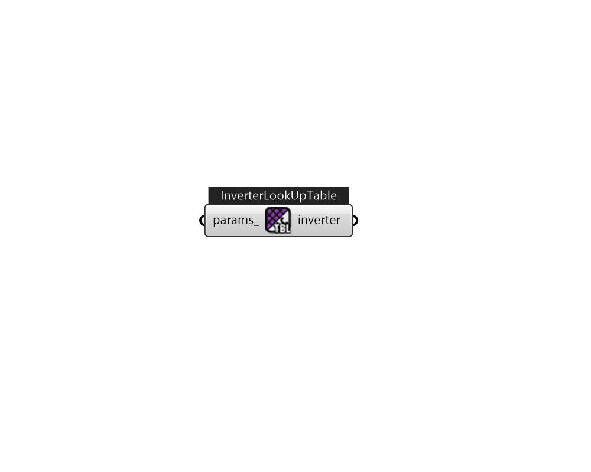

## IB_ElectricLoadCenterInverterLookUpTable

This input object is used to model conversion from Direct Current (DC) to Alternating Current (AC) in an electric load center that contains photovoltaic modules. Such a load center has an array of photovoltaic modules that feed an inverter DC power and the inverter produces AC power. This input object is for an inverter model where efficiency is interpolated using a look up table. This object was designed for use with data contained in the Inverter Performance Test Summaries available at \url{http://www.gosolarcalifornia.org/equipment/inverter_tests/summaries}. All of the data needed for this object can be found there by make and model of inverter. The core of the data set is a 3x6 matrix of efficiency at different voltage and power levels. These form the look up table used in the model. Note that EnergyPlus PV models currently model only power and not the voltage and current situation. Therefore, only the nominal voltage data are used. This is the middle row of data in the Go Solar s.... (Due to the length of content, documentation has been shown partially)  Above content copyright © 1996-2025 EnergyPlus, all contributors. All rights reserved. EnergyPlus is a trademark of the US Department of Energy. 

#### Inputs
* ##### params 
Detail settings for this HVAC object. Use Ironbug_ObjParams to set input parameters, or use Ironbug_OutputParams to set output variables. 

#### Outputs
* ##### inverter
inverter 