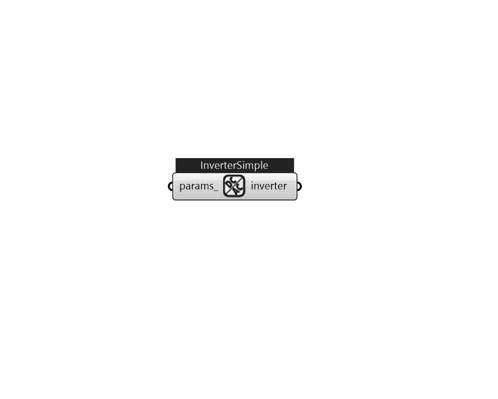

## IB_ElectricLoadCenterInverterSimple

This input object is used to model conversion from Direct Current (DC) to Alternating Current (AC) in an electric load center that contains photovoltaic modules. Such a load center has an array of photovoltaic modules that feed an inverter DC power and the inverter produces AC power. This input object is for the simplest inverter model and uses a fixed efficiency. There are two other types of inverters with more complex models described below.  Above content copyright © 1996-2025 EnergyPlus, all contributors. All rights reserved. EnergyPlus is a trademark of the US Department of Energy. 

#### Inputs
* ##### params 
Detail settings for this HVAC object. Use Ironbug_ObjParams to set input parameters, or use Ironbug_OutputParams to set output variables. 

#### Outputs
* ##### inverter
inverter 