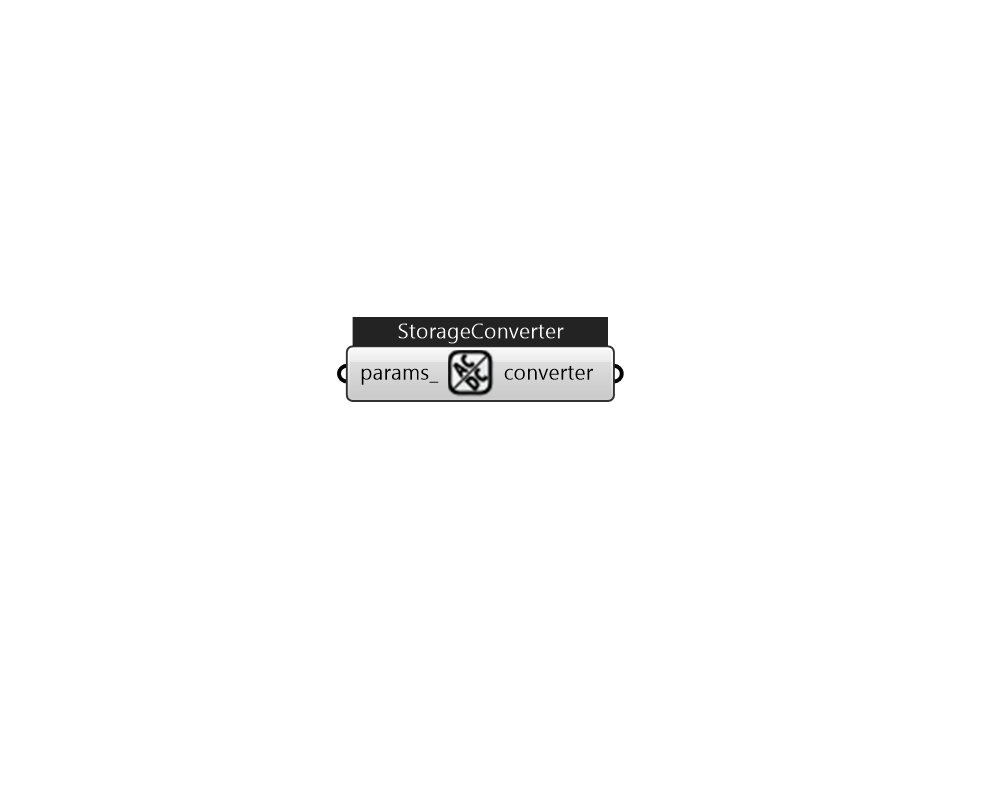

## IB_ElectricLoadCenterStorageConverter

This model is for converting AC to DC for grid-supplied charging of DC storage. The model is only for power conversion and does not consider voltage. There are two methods available for determining the efficiency with which power is converted. The efficiency is defined as the ratio of DC power output divided by AC power input. If the name of a zone is entered the power conversion losses will be added to the zone as internal heat gains. The converter is part of a single electric load center.  Above content copyright © 1996-2025 EnergyPlus, all contributors. All rights reserved. EnergyPlus is a trademark of the US Department of Energy. 

#### Inputs
* ##### params 
Detail settings for this HVAC object. Use Ironbug_ObjParams to set input parameters, or use Ironbug_OutputParams to set output variables. 

#### Outputs
* ##### converter
Storage Converter 