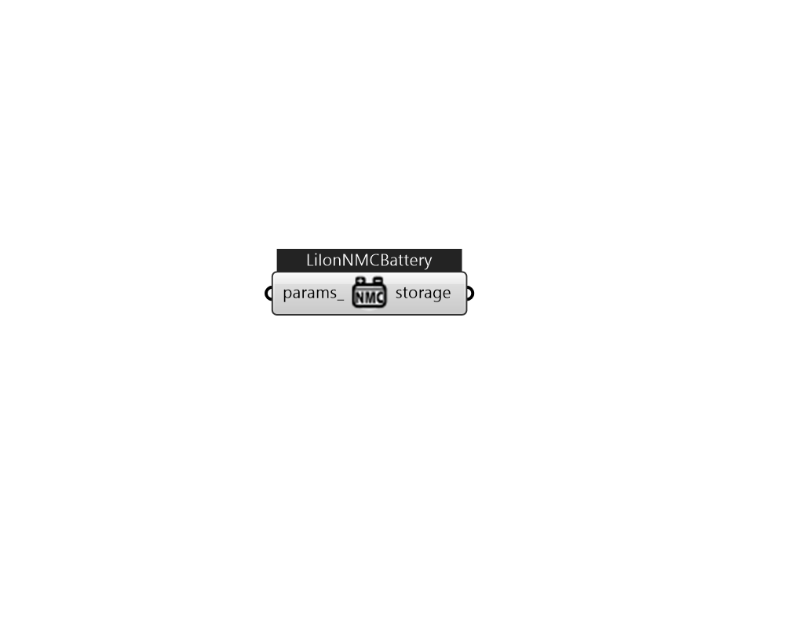

## IB_ElectricLoadCenterStorageLiIonNMCBattery

This object usses the Li-ion NMC battery model from the System Advisor Model (SAM) software.  Above content copyright © 1996-2025 EnergyPlus, all contributors. All rights reserved. EnergyPlus is a trademark of the US Department of Energy. 

#### Inputs
* ##### params 
Detail settings for this HVAC object. Use Ironbug_ObjParams to set input parameters, or use Ironbug_OutputParams to set output variables. 

#### Outputs
* ##### storage
Electrical Storage 