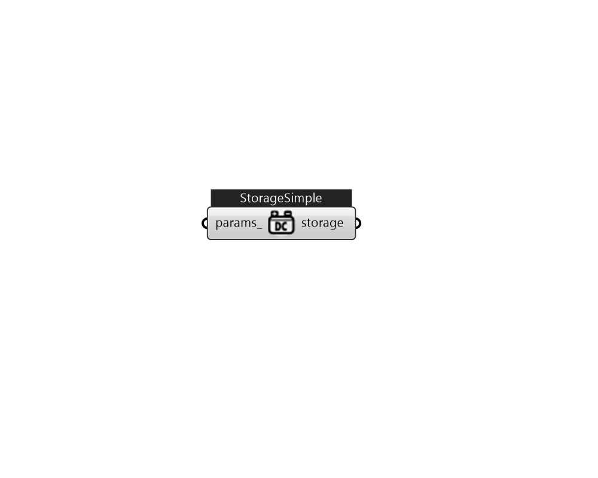

## IB_ElectricLoadCenterStorageSimple

This input object is used to model storage of electricity in an electric load center. This can be used to model a battery or other forms of electrical storage in a simplified manner. The type of power, AC or DC, depends on the configuration chosen as the Electrical Buss Type in the {ElectricLoadCenter:Distribution} object.  Above content copyright © 1996-2025 EnergyPlus, all contributors. All rights reserved. EnergyPlus is a trademark of the US Department of Energy. 

#### Inputs
* ##### params 
Detail settings for this HVAC object. Use Ironbug_ObjParams to set input parameters, or use Ironbug_OutputParams to set output variables. 

#### Outputs
* ##### storage
Electrical Storage 