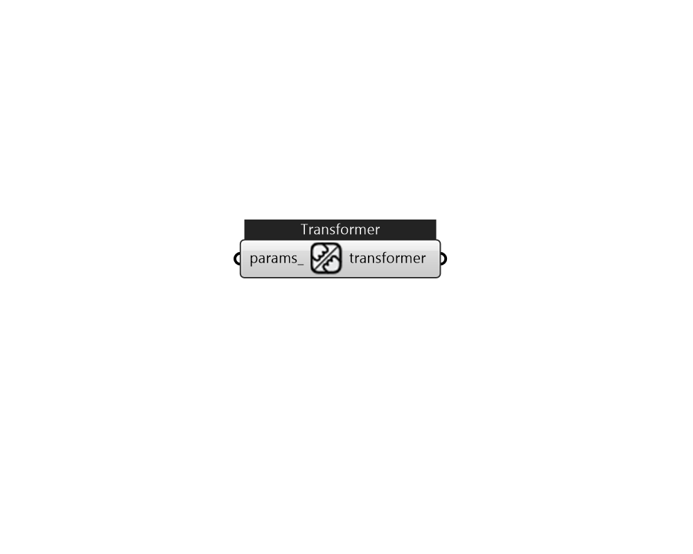

## IB_ElectricLoadCenterTransformer

This object is used to model the energy losses of transformers when they are used to transfer electricity from the grid to a building (as distribution transformers) or transfer electricity from onsite generators to the grid. Distribution transformers reduce the voltage on utility distribution lines (34.5 kV or less) to a lower secondary voltage (600 V or less) suitable for customer equipment. According to the medium used for cooling and insulation, distribution transformers can be classified into liquid-immersed and dry type transformers. According to the input voltages, distribution transformers can be classified into medium-voltage (between 600 V and 34.5kV) and low-voltage transformer (less than 600 V). The transformers used to output the surplus electricity from onsite generators to the grid usually match the cogeneration voltage to the grid. This object can be used for all types of distribution transformers and the transformers used to output electricity from onsite generators to .... (Due to the length of content, documentation has been shown partially)  Above content copyright © 1996-2025 EnergyPlus, all contributors. All rights reserved. EnergyPlus is a trademark of the US Department of Energy. 

#### Inputs
* ##### params 
Detail settings for this HVAC object. Use Ironbug_ObjParams to set input parameters, or use Ironbug_OutputParams to set output variables. 

#### Outputs
* ##### transformer
transformer 