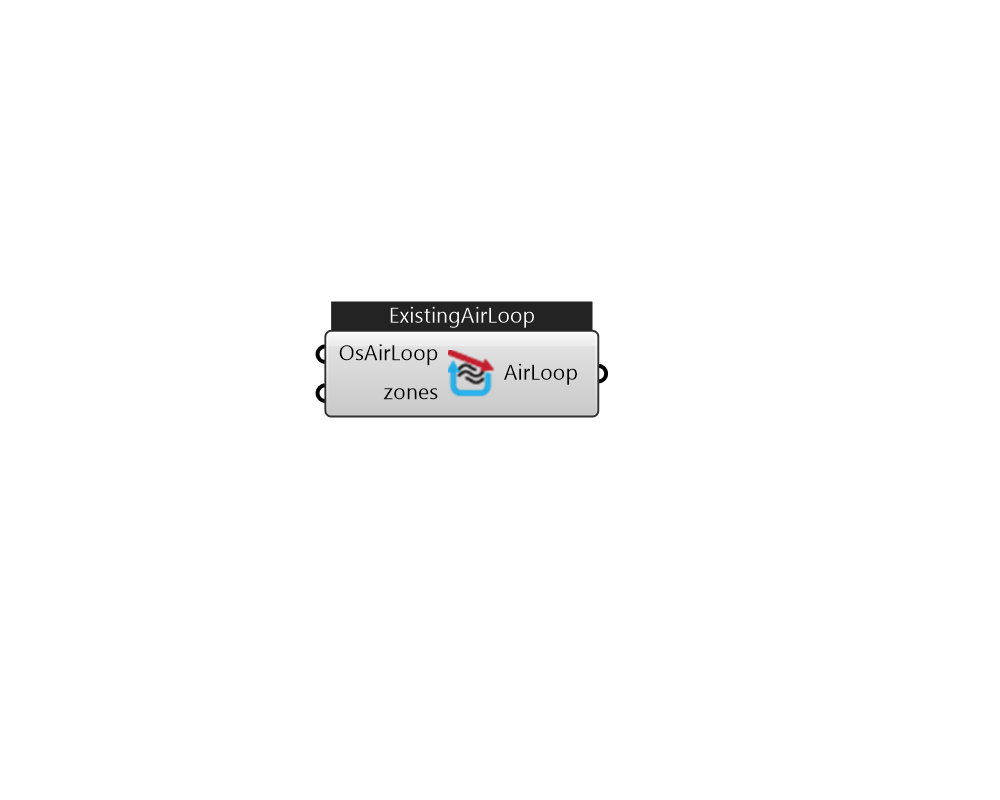

## IB_ExistingAirLoop

Air loops along with zone equipment form the entire forced air heating and cooling system (air side). The main statement for defining an air loop is the AirLoopHVAC object described here. As with the main plant and condenser statements, several of the items in the AirLoopHVAC object definition are actually names that refer to other objects in the input file. After the AirLoopHVAC object name, four such list pointers are encountered: for controllers, system availability, branches, and connectors. The Controller List defines how the air loop will respond due to various inputs (control signals). The Availability Manager List refers to methods for controlling when a system is operational. This may be as simple as a schedule to define when the system is shutdown. The Branch List lists the branches that comprise the primary air system. Finally, the Connector List lists the connections between the branches. The branches and connections together define the primary air system topology. The onl.... (Due to the length of content, documentation has been shown partially)  Above content copyright © 1996-2025 EnergyPlus, all contributors. All rights reserved. EnergyPlus is a trademark of the US Department of Energy. 

#### Inputs
* ##### OsAirLoop 
The existing air loop from Ironbug_ImportOSM component 
* ##### zones 
Zones to be added to new branches of this existing loop 

#### Outputs
* ##### AirLoop
toSaveOSM 