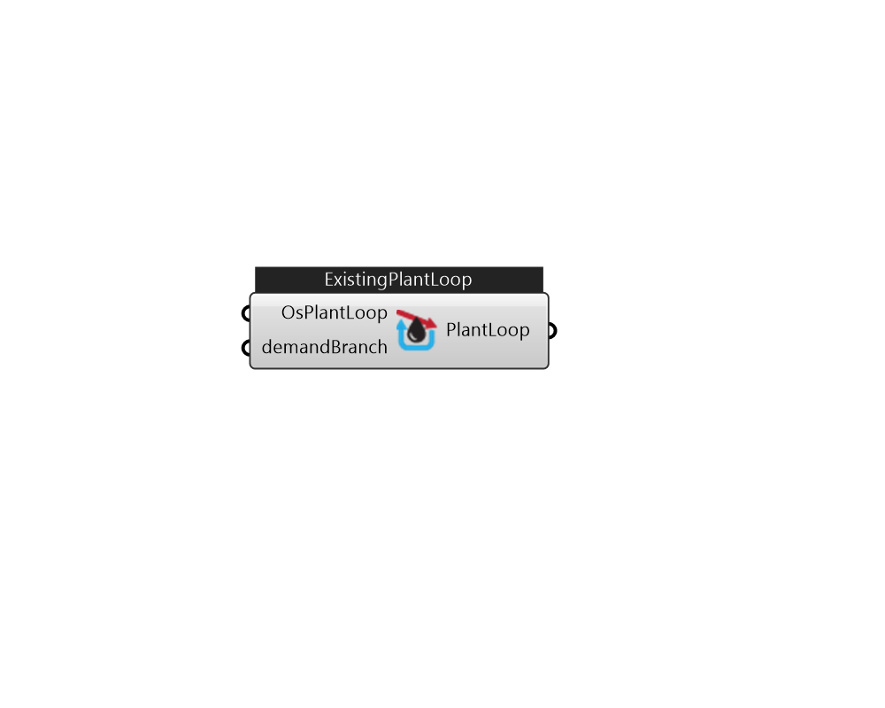

## IB_ExistingPlantLoop

The main elements of the PlantLoop syntax are described in further detail below. A map of how the input for this portion of the HVAC input fits together is provided in the following diagram.  Above content copyright © 1996-2025 EnergyPlus, all contributors. All rights reserved. EnergyPlus is a trademark of the US Department of Energy. 

#### Inputs
* ##### OsPlantLoop 
The existing loop from Ironbug_ImportOSM component 
* ##### demandBranch 
HVAC components in plantBranch to be added to this existing loop 

#### Outputs
* ##### PlantLoop
PlantLoop 