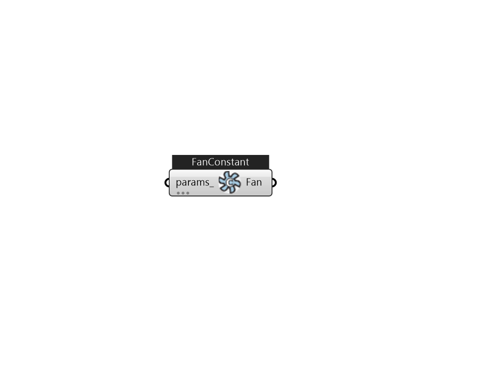

## IB_FanConstantVolume

This object models a constant air volume fan that is intended to operate continuously based on a time schedule. This fan will not cycle on and off based on cooling/heating load or other control signals (Ref: {Fan:OnOff}).  Above content copyright © 1996-2025 EnergyPlus, all contributors. All rights reserved. EnergyPlus is a trademark of the US Department of Energy. 

#### Inputs
* ##### params 
Detail settings for this HVAC object. Use Ironbug_ObjParams to set input parameters, or use Ironbug_OutputParams to set output variables. 

#### Outputs
* ##### Fan
connect to airloop's supply side 