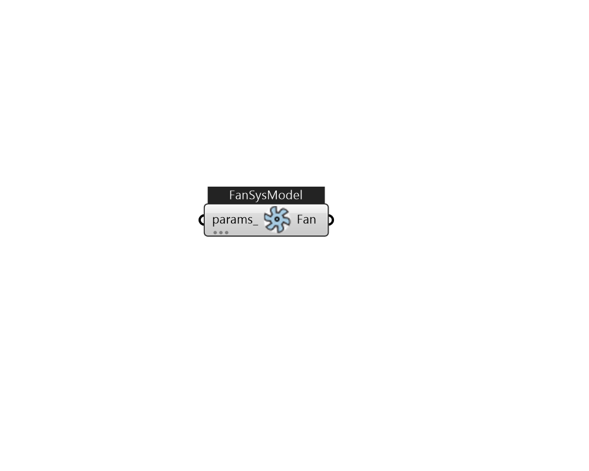

## IB_FanSystemModel

This object models fans of various types using a relatively simple engineering model. This fan can be used in variable air volume, constant volume, on-off cycling, two-speed, or multi-speed applications.  It was designed as a replacement for {Fan:ConstantVolume}, {Fan:OnOff}, {Fan:VariableVolume}, and {FanPerformance:NightVentilation}. The electric power consumed by the fan can be directly input or autosized using one of three optional methods.  For fans that can vary the volume flow rate the performance can be described using a separate performance curve or table object. Or for fans with discrete speed control the power fraction at each speed can be input directly with no need for a performance curve.  Above content copyright © 1996-2025 EnergyPlus, all contributors. All rights reserved. EnergyPlus is a trademark of the US Department of Energy. 

#### Inputs
* ##### params 
Detail settings for this HVAC object. Use Ironbug_ObjParams to set input parameters, or use Ironbug_OutputParams to set output variables. 

#### Outputs
* ##### Fan
Todo.. 