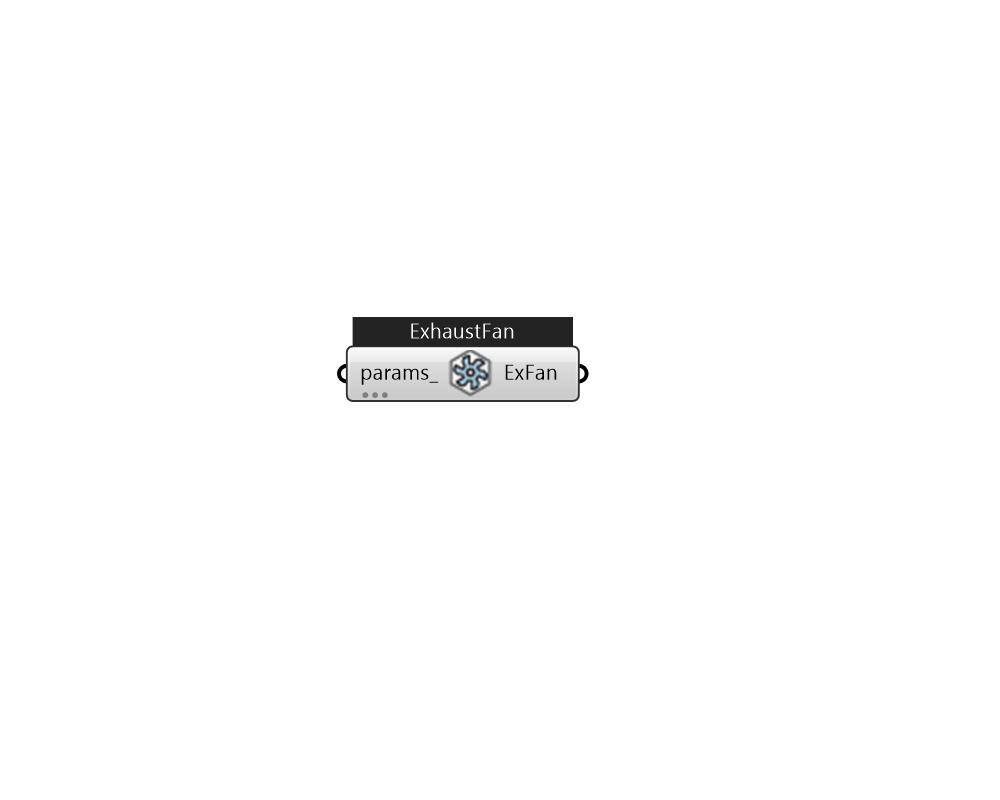

## IB_FanZoneExhaust

This fan object differs from the other fans in that it stands on its own in a zone rather than serving as one part of an HVAC air system. This object appears directly in a {ZoneHVAC:EquipmentList} object and all the controls are contained within the fan object. The zone exhaust fan model provides a way to include the electrical power used by the fan. It can also impact air flows in central air handlers by decreasing the flow of return air and sometimes increasing the outdoor air flow rate. There are several control options available for the exhaust fan including: an on/off availability schedule, interaction with system availability managers, minimum zone air temperature control limits and a variable flow fraction schedule. The way in which the exhaust fan impacts central air system can be controlled by declaring what portion of the flow has been balanced by simple airflow from infiltration, ventilation, or mixing. However, it is important to note that presence of an exhaust fan does .... (Due to the length of content, documentation has been shown partially)  Above content copyright © 1996-2025 EnergyPlus, all contributors. All rights reserved. EnergyPlus is a trademark of the US Department of Energy. 

#### Inputs
* ##### params 
Detail settings for this HVAC object. Use Ironbug_ObjParams to set input parameters, or use Ironbug_OutputParams to set output variables. 

#### Outputs
* ##### ExFan
Connect to zone's equipment 