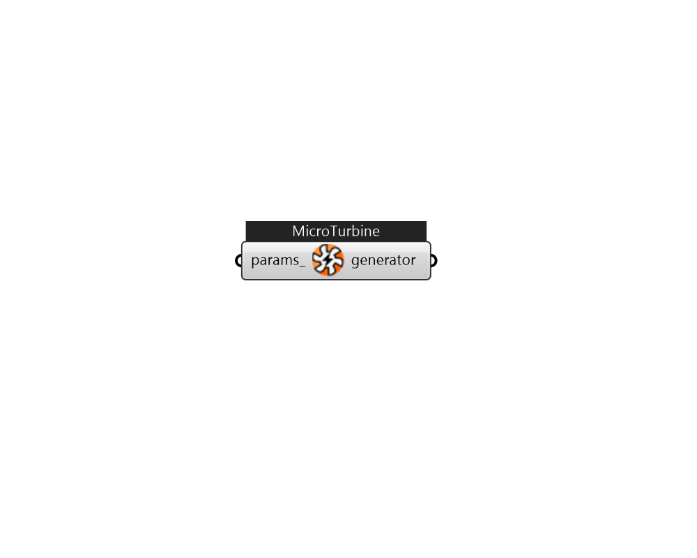

## IB_GeneratorMicroTurbine

MicroTurbine generators are small combustion turbines that produce electricity on a relatively small scale (e.g., 25kW to 500kW). This model uses nominal performance at reference conditions along with several modifier curves to determine electrical power output and fuel use at non-reference conditions. Standby and ancillary power can also be taken into account. Furthermore, energy recovery from exhaust air can be used to heat water. Similar to electrical power output, thermal power (heat recovery) output is calculated using nominal performance at reference conditions with modifier curves to account for variations at non-reference conditions. The following inputs define the MicroTurbine electric generator. The {ElectricLoadCenter:Generators} and {ElectricLoadCenter:Distribution} objects are used to define the availability and control of all electric generators included in the simulation (ref. {ElectricLoadCenter:Generators} and {ElectricLoadCenter:Distribution}).  Above content copyright © 1996-2025 EnergyPlus, all contributors. All rights reserved. EnergyPlus is a trademark of the US Department of Energy. 

#### Inputs
* ##### params 
Detail settings for this HVAC object. Use Ironbug_ObjParams to set input parameters, or use Ironbug_OutputParams to set output variables. 

#### Outputs
* ##### generator
generator 