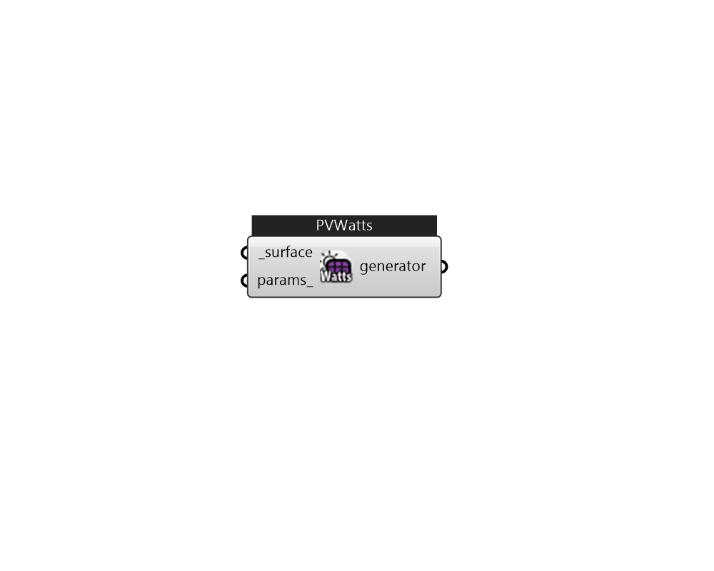

## IB_GeneratorPVWatts

PVWatts is a web application and module in NREL's System Advisor Model (SAM) software that estimates the electricity production of a grid-connected photovoltaic system based on a few simple inputs. This object brings the same calculations from PVWatts into an EnergyPlus whole building simulation without the need to call the web application API or SAM SDK. It provides a good alternative to the {Generator:Photovoltaic} object when detailed information about the PV array is not available such as in a first pass analysis or when the desire is to achieve comparable results to PVWatts outside of EnergyPlus. To get comparable results to PVWatts, it should be used with the {ElectricLoadCenter:Inverter:PVWatts}. The PVWatts:Generator uses SAM 2020.11.29 Revision 0, SSC Revision 250.  Above content copyright © 1996-2025 EnergyPlus, all contributors. All rights reserved. EnergyPlus is a trademark of the US Department of Energy. 

#### Inputs
* ##### surface [Required]
A Honeybee Shade 
* ##### params 
Detail settings for this HVAC object. Use Ironbug_ObjParams to set input parameters, or use Ironbug_OutputParams to set output variables. 

#### Outputs
* ##### generator
generator 