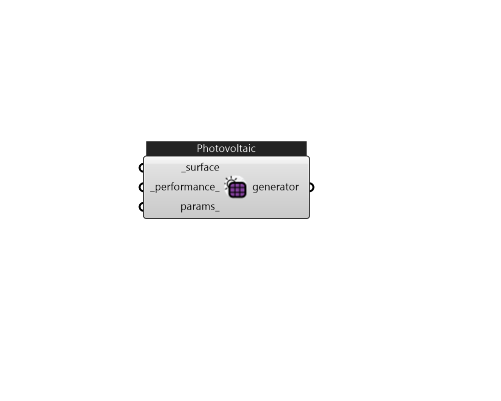

## IB_GeneratorPhotovoltaic

This object is used to describe an array of PV modules and how they are to be modeled. A series of different PV arrays can be connected to a single electric load center (and inverter) by listing them all in an ElectricLoadCenter:Generator object.  Above content copyright © 1996-2025 EnergyPlus, all contributors. All rights reserved. EnergyPlus is a trademark of the US Department of Energy. 

#### Inputs
* ##### surface [Required]
A Honeybee Shade 
* ##### performance 
This field is the type of PV performance model. The choices are the class names for the three modeling options: {PhotovoltaicPerformance:Simple} {PhotovoltaicPerformance:EquivalentOne-Diode} {PhotovoltaicPerformance:Sandia}. 
* ##### params 
Detail settings for this HVAC object. Use Ironbug_ObjParams to set input parameters, or use Ironbug_OutputParams to set output variables. 

#### Outputs
* ##### generator
generator 