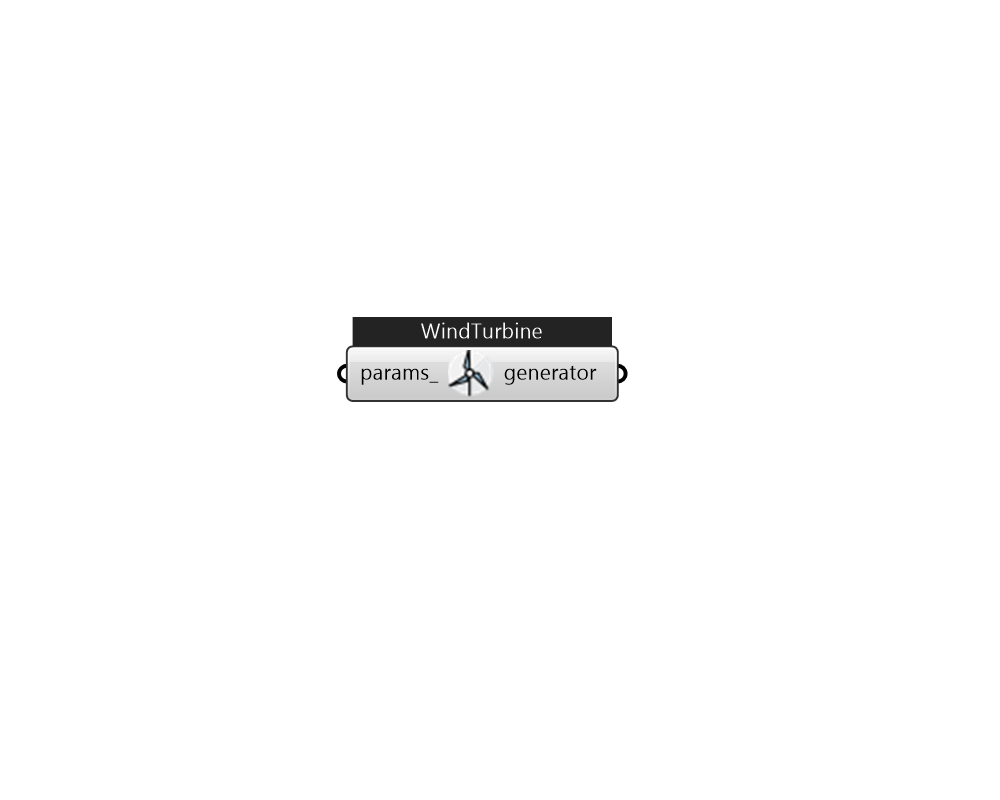

## IB_GeneratorWindTurbine

A wind turbine is a component that converts the kinetic energy of the surrounding airstream into electricity. This model is intended to calculate the electrical power that a wind turbine system produces. The performance of wind turbine systems is dependent on the local environmental conditions such as wind speed and density of air at the height of the systems. An analysis of these conditions is necessary to accurately estimate power output. The model obtains the weather information from the weather data file in EnergyPlus and then determines the wind speed and air density at the specific height of the system. It also requires the user to input the annual average wind speed measured at the local site and the height of the measurement so that it factors in differences between the weather file wind data and the local wind data. The model employs the general kinetic energy equation to calculate the performance characteristics of the horizontal axis wind turbine (HAWT) systems. It provides.... (Due to the length of content, documentation has been shown partially)  Above content copyright © 1996-2025 EnergyPlus, all contributors. All rights reserved. EnergyPlus is a trademark of the US Department of Energy. 

#### Inputs
* ##### params 
Detail settings for this HVAC object. Use Ironbug_ObjParams to set input parameters, or use Ironbug_OutputParams to set output variables. 

#### Outputs
* ##### generator
generator 