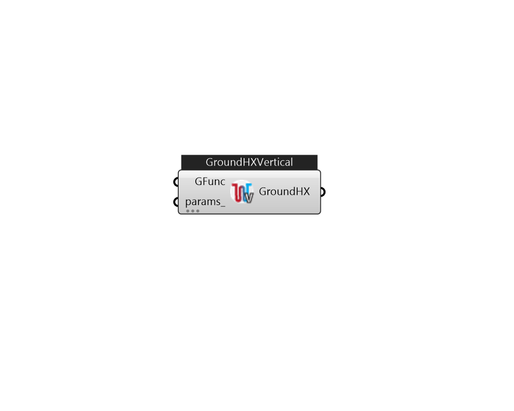

## IB_GroundHeatExchangerVertical

There is no component description available now!  Please stay tuned or contribute :>  Source code: https://github.com/MingboPeng/Ironbug 

#### Inputs
* ##### GFunc 
A list of values for gFunctions. This list has to be even count. The odd item has to be gFunctionLN, and its value the next item 
* ##### params 
Detail settings for this HVAC object. Use Ironbug_ObjParams to set input parameters, or use Ironbug_OutputParams to set output variables. 

#### Outputs
* ##### GroundHX
GroundHeatExchangerVertical 