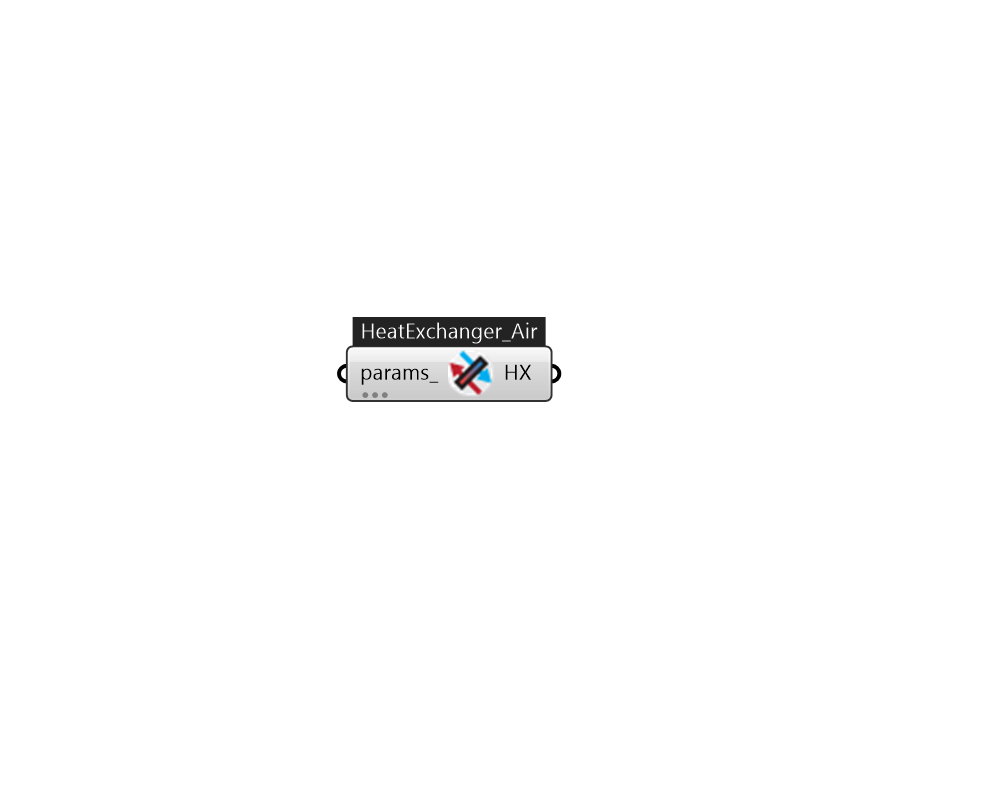

## IB_HeatExchangerAirToAirSensibleAndLatent

The sensible and latent air-to-air heat exchanger is an HVAC component typically used for exhaust or relief air heat recovery (Figure 150). Heat exchanger performance can be specified to transfer sensible energy, latent energy or both between the supply and exhaust air streams. The input requires no geometric data. Performance is defined by specifying sensible and/or latent effectiveness at 75% and 100% of the nominal (rated) supply air flow rate at two operating conditions as shown in Table{table:operating-conditions-for-defining-heat}. % table 30 Note: Conditions consistent with the Air-Conditioning and Refrigeration Institute's (ARI) Standard 1060-2001. This object models the basic operation of an air-to-air heat exchanger. Heat exchange between the supply and exhaust air streams occurs whenever the unit is scheduled to be available (Availability schedule) and supply/exhaust air flow is present. This heat exchanger object can be used in conjunction with a conventional air-side ec.... (Due to the length of content, documentation has been shown partially)  Above content copyright © 1996-2025 EnergyPlus, all contributors. All rights reserved. EnergyPlus is a trademark of the US Department of Energy. 

#### Inputs
* ##### params 
Detail settings for this HVAC object. Use Ironbug_ObjParams to set input parameters, or use Ironbug_OutputParams to set output variables. 

#### Outputs
* ##### HX
to OutdoorAirSystem 