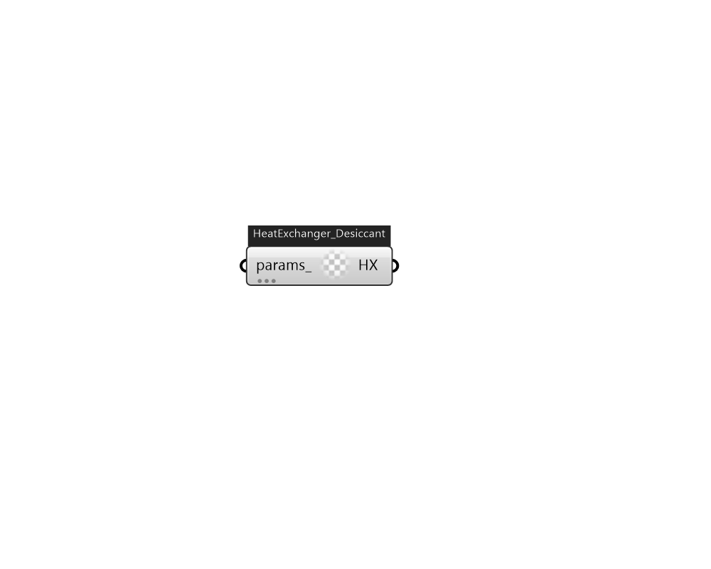

## IB_HeatExchangerDesiccantBalancedFlow

This desiccant heat exchanger object is an HVAC component used to model both temperature (sensible) and moisture (latent) heat exchange between two air streams (Figure{fig:schematic-of-the-balanced-flow-desiccant-heat}). The model assumes balanced air flow through the regeneration and process sides of the heat exchanger (i.e., regeneration and process air volume flow rates and face velocities are the same). Heat exchanger performance is specified through a performance data type object (e.g., {HeatExchanger:Desiccant:BalancedFlow:PerformanceDataType1}). Currently, this desiccant heat exchanger model can be referenced by two compound objects: {CoilSystem:Cooling:DX:HeatExchangerAssisted} and {Dehumidifier:Desiccant:System}, both of which are used to provide enhanced dehumidification over conventional systems. If this heat exchanger is referenced by a compound object, the compound object will control heat exchanger operation (i.e., tell the heat exchanger if heat exchange is needed or no.... (Due to the length of content, documentation has been shown partially)  Above content copyright © 1996-2025 EnergyPlus, all contributors. All rights reserved. EnergyPlus is a trademark of the US Department of Energy. 

#### Inputs
* ##### params 
Detail settings for this HVAC object. Use Ironbug_ObjParams to set input parameters, or use Ironbug_OutputParams to set output variables. 

#### Outputs
* ##### HX
to OutdoorAirSystem 