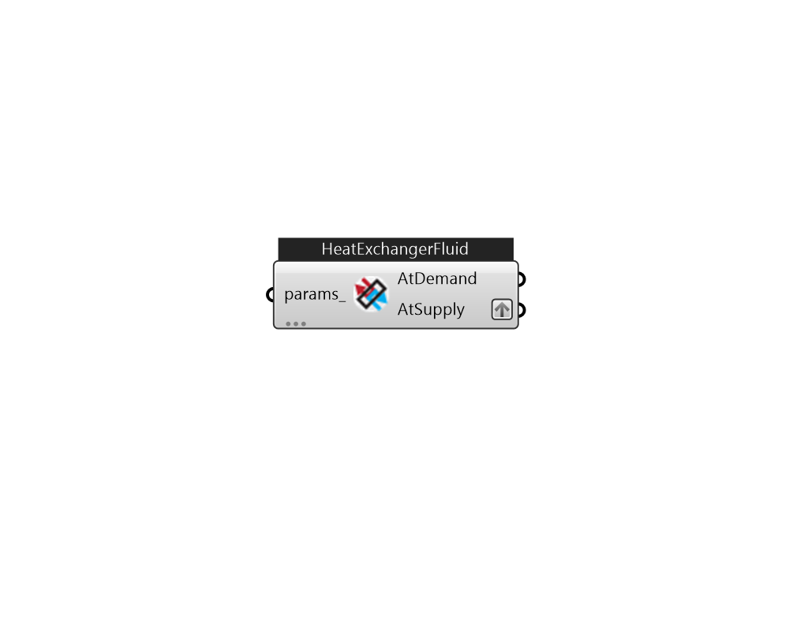

## IB_HeatExchangerFluidToFluid

A fluid-to-fluid heat exchanger designed to couple the supply side of one plant or condenser loop to the demand side of another plant or condenser loop. This heat exchanger is fairly general and can be configured for use in any application where any two loops need to be connected together. The only constraints are that that one side must be connected to the supply side of one loop and the other side connected to the demand side of a different loop. Because the heat exchanger is intended to be generic, its two sides are distinguished by the nature of loop side being connected. One side is called {Loop Supply Side} to indicate the heat exchanger is situated on the supply side of a loop. The other side is called {Loop Demand Side} to indicate it is on the demand side of a loop. The heat exchanger is intended to act as a supply component for the loop connected to it as the ``Loop Supply Side'' and as a demand component for the loop connected to it as the ``Loop Demand Side.'' From .... (Due to the length of content, documentation has been shown partially)  Above content copyright © 1996-2025 EnergyPlus, all contributors. All rights reserved. EnergyPlus is a trademark of the US Department of Energy. 

#### Inputs
* ##### params 
Detail settings for this HVAC object. Use Ironbug_ObjParams to set input parameters, or use Ironbug_OutputParams to set output variables. 

#### Outputs
* ##### AtDemand
HeatExchangerFluidToFluid connects to source plantloop demand side. 
* ##### AtSupply
HeatExchangerFluidToFluid connects to another plantloop supply side. 