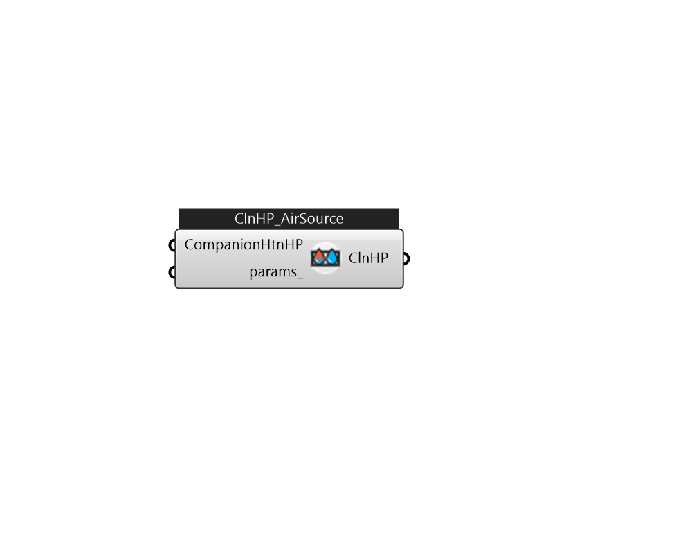

## IB_HeatPumpPlantLoopEIRCooling_AirSource

The EIR-formulated cooling model objects are described.  Above content copyright © 1996-2025 EnergyPlus, all contributors. All rights reserved. EnergyPlus is a trademark of the US Department of Energy. 

#### Inputs
* ##### CompanionHtnHP 
CompanionHeatingHeatPump 
* ##### params 
Detail settings for this HVAC object. Use Ironbug_ObjParams to set input parameters, or use Ironbug_OutputParams to set output variables. 

#### Outputs
* ##### ClnHP
Connect to chilled water loop's supply side. 