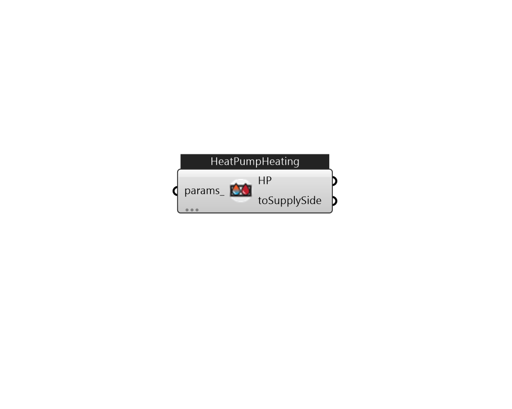

## IB_HeatPumpWaterToWaterEquationFitHeating

There is no documentation available 

#### Inputs
* ##### params 
Detail settings for this HVAC object. Use Ironbug_ObjParams to set input parameters, or use Ironbug_OutputParams to set output variables. 

#### Outputs
* ##### HP
HeatPumpWaterToWaterEquationFitHeating 
* ##### toSupplySide
HeatPumpWaterToWaterEquationFitHeating 