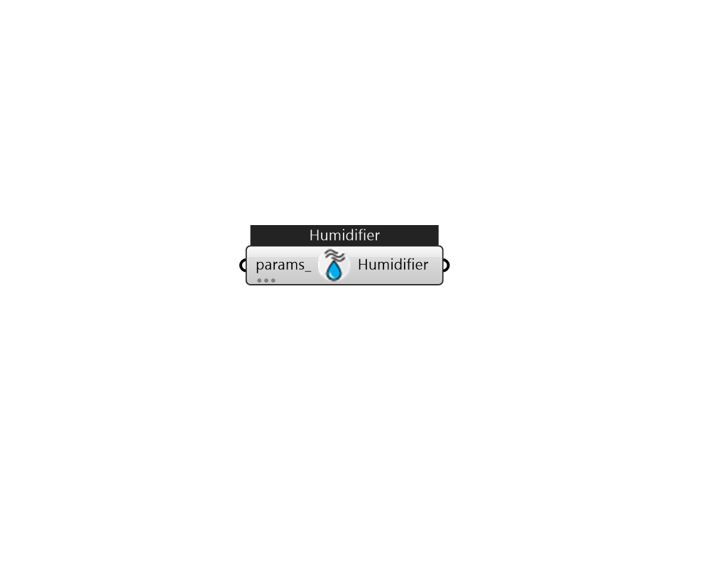

## IB_HumidifierSteamElectric

The electric steam humidifier is a component that represents an electrically heated, self contained steam humidifier. The component uses electrical energy to convert ordinary tap water to steam which it then injects into the supply air stream by means of a blower fan. The actual unit might be an electrode-type humidifier or a resistance-type humidifier. The humidifier model includes local control of the humidifier unit to meet a humidity ratio setpoint on its air outlet node. A set point manager is needed to put a setpoint on the exit node but no other local controllers are needed. The humidifier will add moisture to meet the humidity ratio setpoint.  Above content copyright © 1996-2025 EnergyPlus, all contributors. All rights reserved. EnergyPlus is a trademark of the US Department of Energy. 

#### Inputs
* ##### params 
Detail settings for this HVAC object. Use Ironbug_ObjParams to set input parameters, or use Ironbug_OutputParams to set output variables. 

#### Outputs
* ##### Humidifier
connect to airloop's supply side 