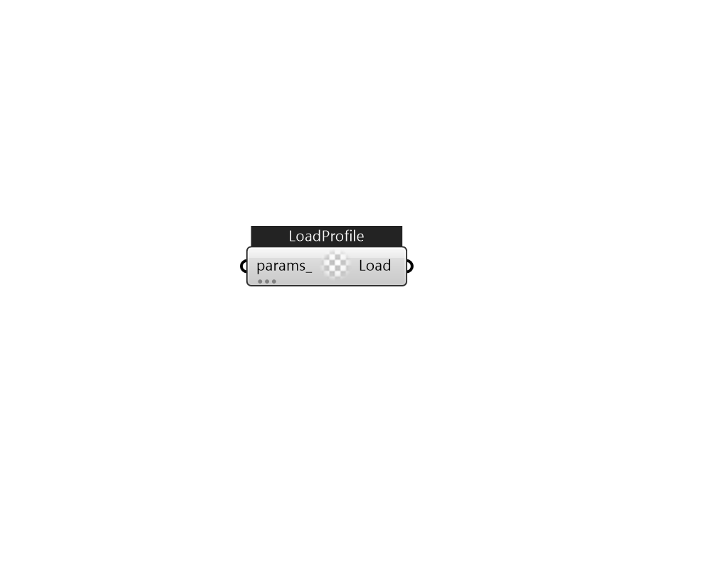

## IB_LoadProfilePlant

The LoadProfile:Plant object is used to simulate a scheduled demand profile. This can be useful when the building loads are already known. Demanded load and flow rate are schedules specified in the object definition. The load profile can specify heating and cooling loads. Cooling loads are entered as negative numbers. The actual load met is dependent on the performance of the supply loop components. The LoadProfile:Plant object must be connected on the demand side of the plant loop. It should be located on a Branch with its control type set to Active. If desired, multiple LoadProfile:Plant objects can be combined in series and/or parallel.  Above content copyright © 1996-2025 EnergyPlus, all contributors. All rights reserved. EnergyPlus is a trademark of the US Department of Energy. 

#### Inputs
* ##### params 
Detail settings for this HVAC object. Use Ironbug_ObjParams to set input parameters, or use Ironbug_OutputParams to set output variables. 

#### Outputs
* ##### Load
LoadProfilePlant as a plant demand component 