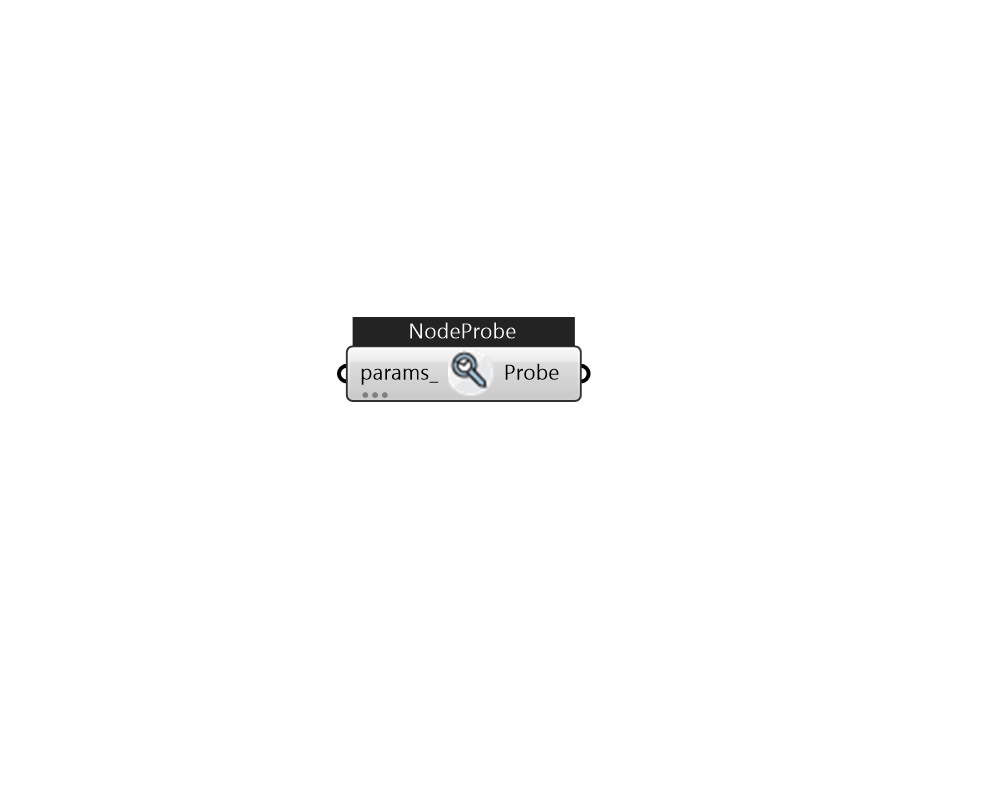

## IB_NodeProbe

Use this component to measure variables like temperature, flow rate, etc, in the loop. Place this between loopObjects. 

#### Inputs
* ##### params 
Detail settings for this HVAC object. Use Ironbug_ObjParams to set input parameters, or use Ironbug_OutputParams to set output variables. 

#### Outputs
* ##### Probe
TODO.... 