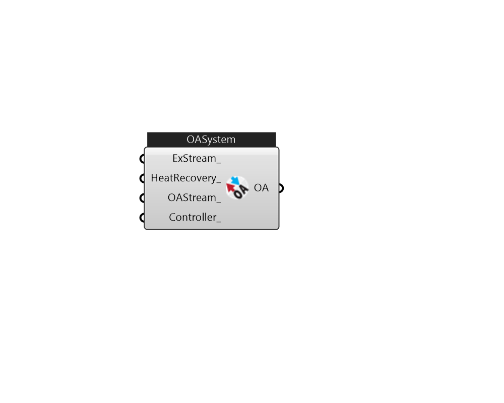

## IB_OutdoorAirSystem

The Outside Air System (object AirLoopHVAC:OutdoorAirSystem) is a subsystem of an AirLoopHVAC. It handles the mixed air portion of the primary air system: the system relief air, the outside air inlet, and any components and controllers associated with the system relief air and outside air streams. From the perspective of the primary air loop the Outside Air System is treated as a single component. As a subsystem, it can contain one or more components and controllers. The input for the Outside Air System consists of a system name, a controller list name, and an equipment list name. The controller list simply lists, by type and unique name, all the controllers in the subsystem. The controllers will be simulated in list order. The equipment list lists all the components in the subsystem, by type and name. The equipment is simulated in list order. The equipment inlet/outlet must be sequential with no loops - the simulation can only handle a straight-through air path, both on the primary air side and on the secondary air side, if any. Heat exchanger secondary air inlets need to be independent of the primary air stream – usually relief air is used. The Outside Air System (object AirLoopHVAC:OutdoorAirSystem) can also be defined as a subsystem of an {AirLoopHVAC:DedicatedOutdoorAirSystem}. When this subsystem is referred in AirLoopHVAC:DedicatedOutdoorAirSystem, the {Controller:OutdoorAir} can not be listed in the {AirLoopHVAC:ControllerList}, because the outdoor air flow rate will not be determined by Controller:OutdoorAir. Instead, the outdoor air flow rate will be specified by {AirLoopHVAC:DedicatedOutdoorAirSystem}.  In addition, the {OutdoorAir:Mixer} will not be allowed in the {AirLoopHVAC:OutdoorAirSystem:EquipmentList} as a component, because no mix is needed due to 100% outdoor incoming airflow determined by AirLoopHVAC:DedicatedOutdoorAirSystem. 

#### Inputs
* ##### ExStream 
add objs to outdoor air exhaust stream 
* ##### HeatRecovery 
HeatRecovery 
* ##### OAStream 
add objs to outdoor air intake stream 
* ##### Controller 
Controller for OutdoorAirSystem 

#### Outputs
* ##### OA
OutdoorAirSystem 