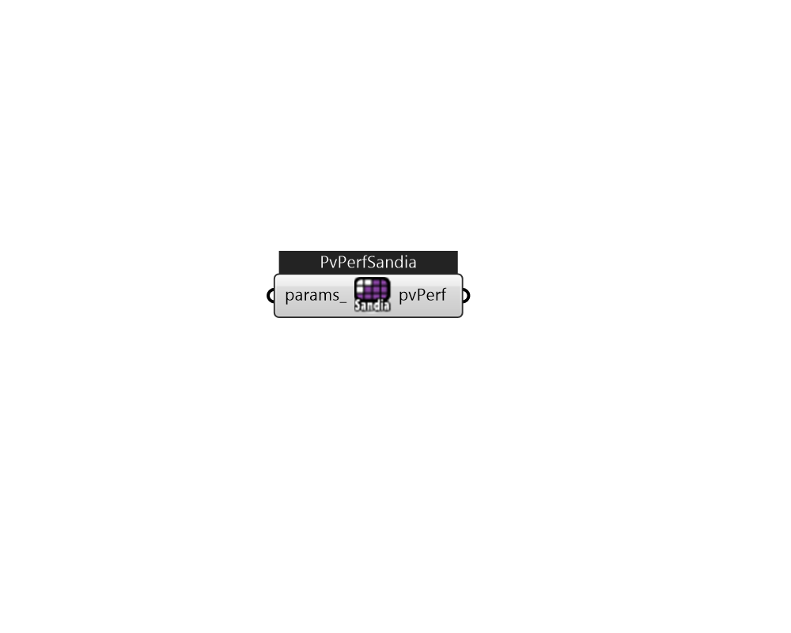

## IB_PhotovoltaicPerformanceSandia

This PhotovoltaicPerformance:Sandia object describes the performance of a single type of module. The model used with this object for predicting the electricity generated by photovoltaics is referred to as the Sandia model. This model is based on work done at Sandia National Lab, Albuquerque, NM by David King – with the help of many others. This object describes performance input data needed for specific makes and models of production PV panels using the empirical coefficients assembled by Sandia National Laboratory. There are a large number of empirical coefficients required to use the Sandia model. These data are obtained after extensive measurements and data reduction. This testing has been performed for some types of production panels and Sandia publishes a database of module and array performance parameters on the web at www.sandia.gov/pv. The entries in the database as of January 15, 2004 were converted to idf segments and are included with the EnergyPlus release in the library f.... (Due to the length of content, documentation has been shown partially)  Above content copyright © 1996-2025 EnergyPlus, all contributors. All rights reserved. EnergyPlus is a trademark of the US Department of Energy. 

#### Inputs
* ##### params 
Detail settings for this HVAC object. Use Ironbug_ObjParams to set input parameters, or use Ironbug_OutputParams to set output variables. 

#### Outputs
* ##### pvPerf
Connect to IB_GeneratorPhotovoltaic 