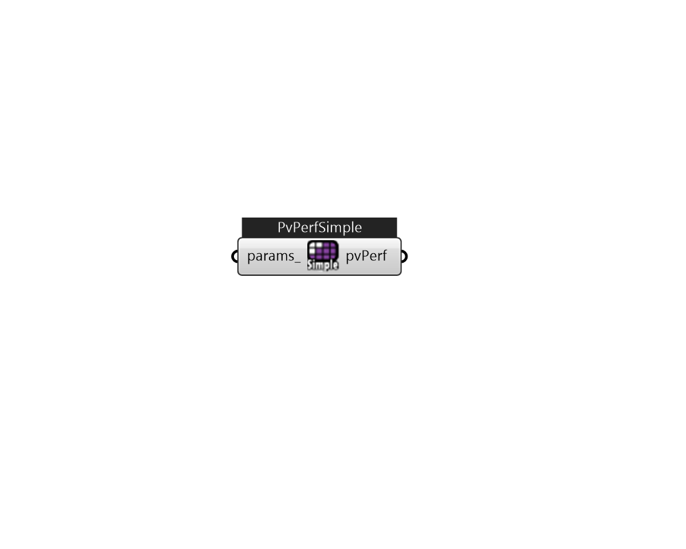

## IB_PhotovoltaicPerformanceSimple

The PhotovoltaicPerformance:Simple object describes a simple model of photovoltaics that may be useful for early phase design analysis. In this model the user has direct access to the efficiency with which surfaces convert incident solar radiation to electricity and need not specify arrays of specific modules. The full geometric model for solar radiation is used, including shading and reflections, to determine the incident solar resource. This model is intended to be useful for design purposes to quickly get an idea of the levels for annual production and peak power. The model can also accept arbitrary conversion efficiencies and does not require actual production units be tested to obtain performance coefficients.  Above content copyright © 1996-2025 EnergyPlus, all contributors. All rights reserved. EnergyPlus is a trademark of the US Department of Energy. 

#### Inputs
* ##### params 
Detail settings for this HVAC object. Use Ironbug_ObjParams to set input parameters, or use Ironbug_OutputParams to set output variables. 

#### Outputs
* ##### pvPerf
Connect to IB_GeneratorPhotovoltaic 