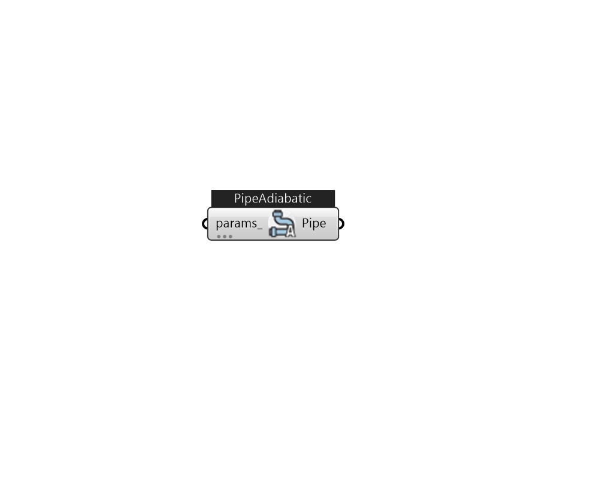

## IB_PipeAdiabatic

In reality, every component is connected to its closest neighbors via a pipe or a duct. At the current time, such detail is not needed in EnergyPlus. Thus, the Pipe:Adiabatic component is currently used more as a connection device (for branches that really do not have any components associated with them) or as a bypass than anything else. As such, its input is very simple and its algorithm is equally simple. The current algorithm for a pipe is simply to pass the inlet conditions to the outlet of the pipe component.  Above content copyright © 1996-2025 EnergyPlus, all contributors. All rights reserved. EnergyPlus is a trademark of the US Department of Energy. 

#### Inputs
* ##### params 
Detail settings for this HVAC object. Use Ironbug_ObjParams to set input parameters, or use Ironbug_OutputParams to set output variables. 

#### Outputs
* ##### Pipe
PipeAdiabatic 