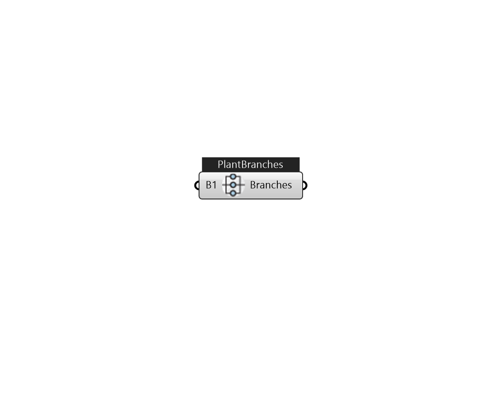

## IB_PlantBranches

Description 

#### Inputs
* ##### B1 
Items to be added to a branch. Tree structured objects will be automatically converted to branches, instead of one branch. 

#### Outputs
* ##### Branches
use this in plantloop 