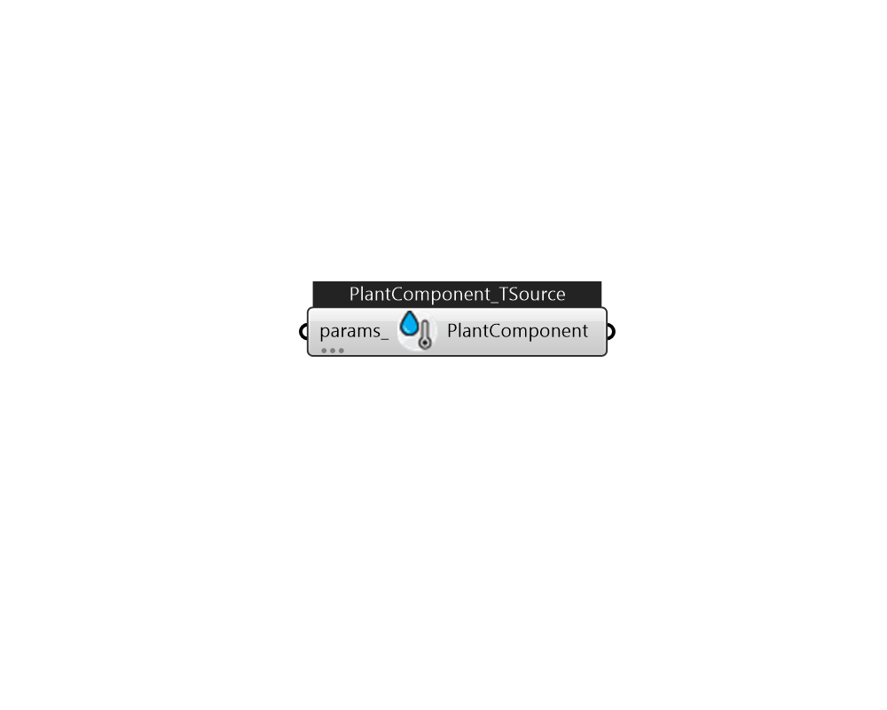

## IB_PlantComponentTemperatureSource

This object allows the simulation of a water (or other fluid) source at a user-specified temperature. This could include a river, well, or seawater source, or any other configuration where the fluid temperature being supplied by the component to the plant is known. The temperature may be a constant or scheduled. Of course, the scheduled value may also be overwritten via EMS in cases where the specified temperature should be calculated at run-time.  Above content copyright © 1996-2025 EnergyPlus, all contributors. All rights reserved. EnergyPlus is a trademark of the US Department of Energy. 

#### Inputs
* ##### params 
Detail settings for this HVAC object. Use Ironbug_ObjParams to set input parameters, or use Ironbug_OutputParams to set output variables. 

#### Outputs
* ##### PlantComponent
PlantComponentTemperatureSource for plant loop's supply. 