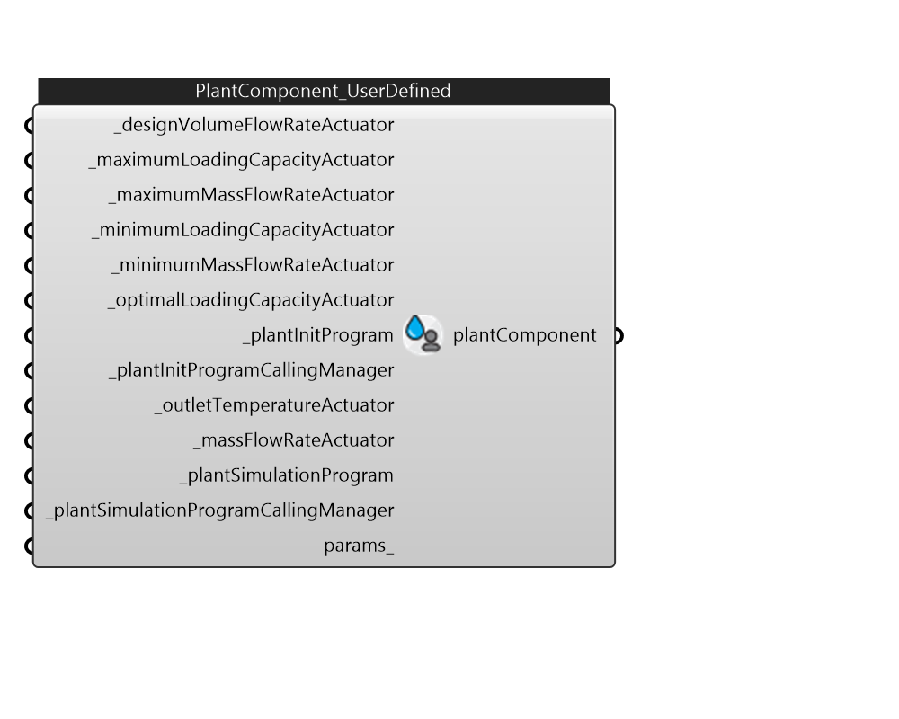

## IB_PlantComponentUserDefined

There is no component description available now!  Please stay tuned or contribute :>  Source code: https://github.com/MingboPeng/Ironbug 

#### Inputs
* ##### designVolumeFlowRateActuator [Required]
_designVolumeFlowRateActuator 
* ##### maximumLoadingCapacityActuator [Required]
_maximumLoadingCapacityActuator 
* ##### maximumMassFlowRateActuator [Required]
_maximumMassFlowRateActuator 
* ##### minimumLoadingCapacityActuator [Required]
_minimumLoadingCapacityActuator 
* ##### minimumMassFlowRateActuator [Required]
_minimumMassFlowRateActuator 
* ##### optimalLoadingCapacityActuator [Required]
_optimalLoadingCapacityActuator 
* ##### plantInitProgram [Required]
_plantInitProgram 
* ##### plantInitProgramCallingManager [Required]
_plantInitProgramCallingManager 
* ##### outletTemperatureActuator [Required]
_outletTemperatureActuator 
* ##### massFlowRateActuator [Required]
_massFlowRateActuator 
* ##### plantSimulationProgram [Required]
_plantSimulationProgram 
* ##### plantSimulationProgramCallingManager [Required]
_plantSimulationProgramCallingManager 
* ##### params 
Detail settings for this HVAC object. Use Ironbug_ObjParams to set input parameters, or use Ironbug_OutputParams to set output variables. 

#### Outputs
* ##### plantComponent
PlantComponentUserDefined for plant loop's supply. 