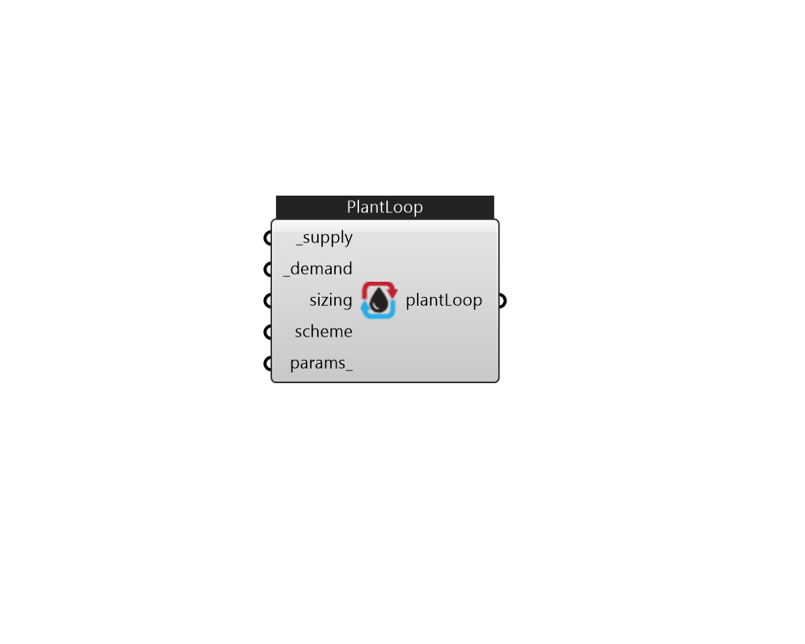

## IB_PlantLoop

The main elements of the PlantLoop syntax are described in further detail below. A map of how the input for this portion of the HVAC input fits together is provided in the following diagram.  Above content copyright © 1996-2025 EnergyPlus, all contributors. All rights reserved. EnergyPlus is a trademark of the US Department of Energy. 

#### Inputs
* ##### supply [Required]
HVAC components 
* ##### demand [Required]
HVAC components 
* ##### sizing 
HVAC components 
* ##### scheme 
HVAC components 
* ##### params 
Detail settings for this HVAC object. Use Ironbug_ObjParams to set input parameters, or use Ironbug_OutputParams to set output variables. 

#### Outputs
* ##### plantLoop
plantLoop 