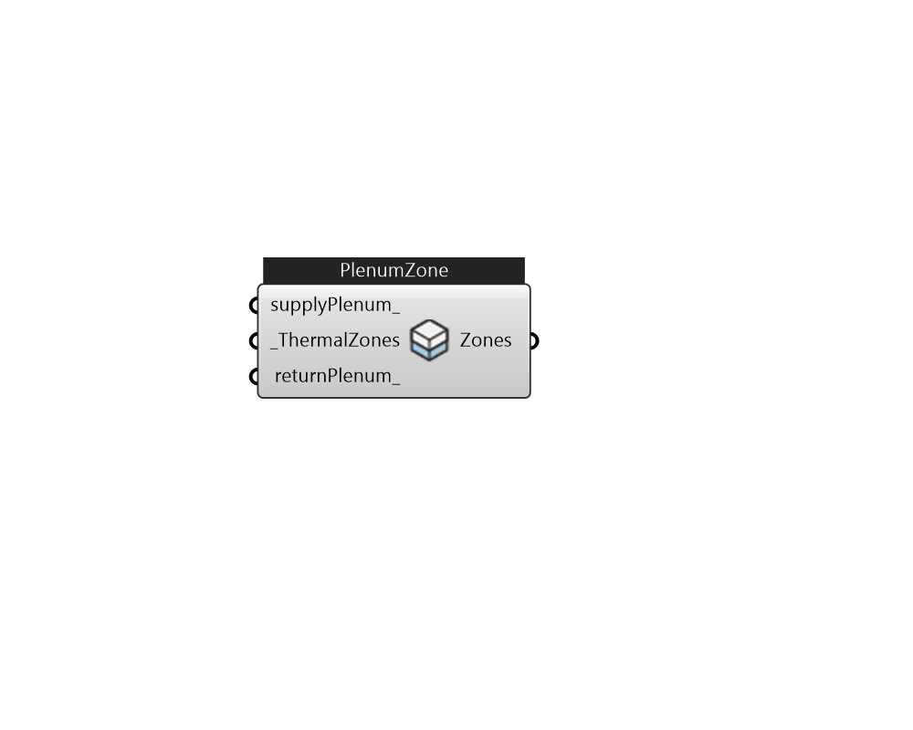

## IB_PlenumZone

Attach supply or/and return plenum zones to thermal zones in the airloop. 

#### Inputs
* ##### supplyPlenum 
Use HBRoom or OsZones. This plenumZone will be connect to all thermal zones 
* ##### ThermalZones [Required]
Add Ironbug_ThermalZones to here to attach their supply and return plenums. 
* ##### returnPlenum 
Use HBRoom or OsZones. This plenumZone will be connect to all thermal zones 

#### Outputs
* ##### Zones
ThermalZones with plenumZones attached, connect to airloop's demand side 