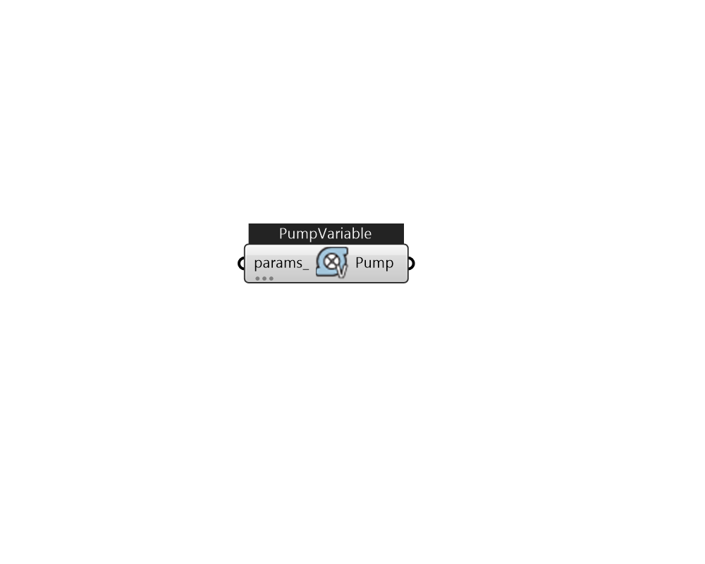

## IB_PumpVariableSpeed

Pumps are needed in both plant and condenser loops. The syntax for a variable speed pump is given below.  Above content copyright © 1996-2025 EnergyPlus, all contributors. All rights reserved. EnergyPlus is a trademark of the US Department of Energy. 

#### Inputs
* ##### params 
Detail settings for this HVAC object. Use Ironbug_ObjParams to set input parameters, or use Ironbug_OutputParams to set output variables. 

#### Outputs
* ##### Pump
connect to plantloop's supply side 