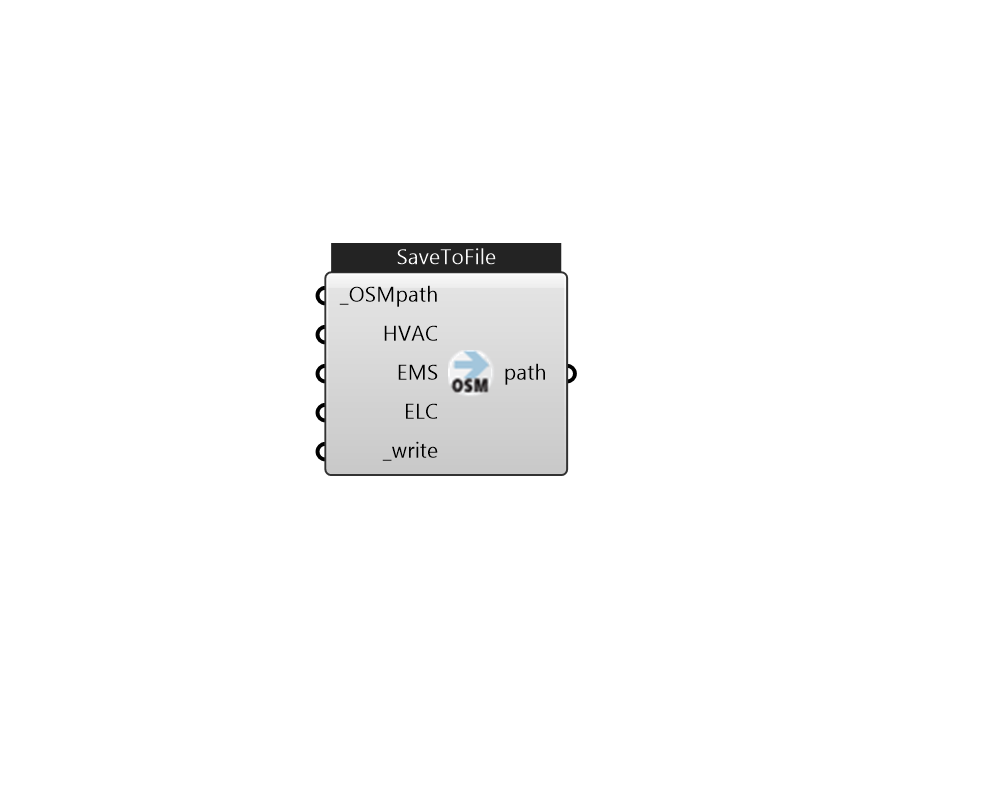

## IB_SaveToFile

Save HVACSystem to OpenStudio (.osm) file 

#### Inputs
* ##### OSMpath [Required]
New OSM file path. This file will be deleted first if it is existed when the component is on override mode. 
* ##### HVAC 
A HVAC system from Ironbug_HVACSystem 
* ##### EMS 
EnergyManagementSystem 
* ##### ELC 
ElectricLoadCenter 
* ##### write [Required]
Write the OpenStudio file. 

#### Outputs
* ##### path
file path 