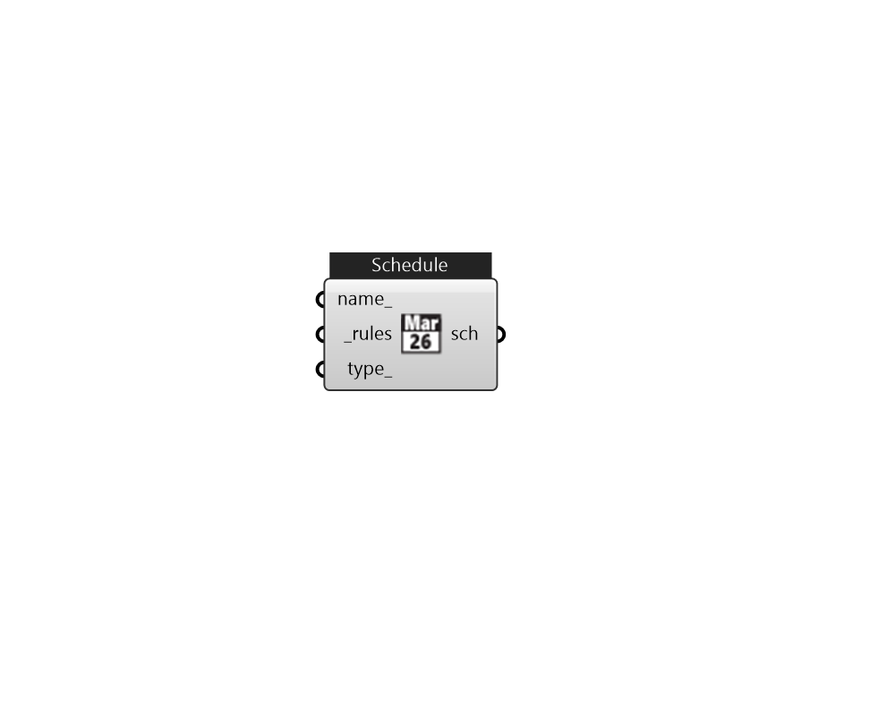

## IB_Schedule

 

#### Inputs
* ##### name 
Name for this schedule 
* ##### rules [Required]
One value for all day or 24 value for each hour, or use a list of scheduleRules from Ironbug_ScheduleRules. The last ScheduleRule will be set to the default (base) schedule that applies to the whole year. 
* ##### type 
Use Ironbug_ScheduleType 

#### Outputs
* ##### sch
TODO.. 