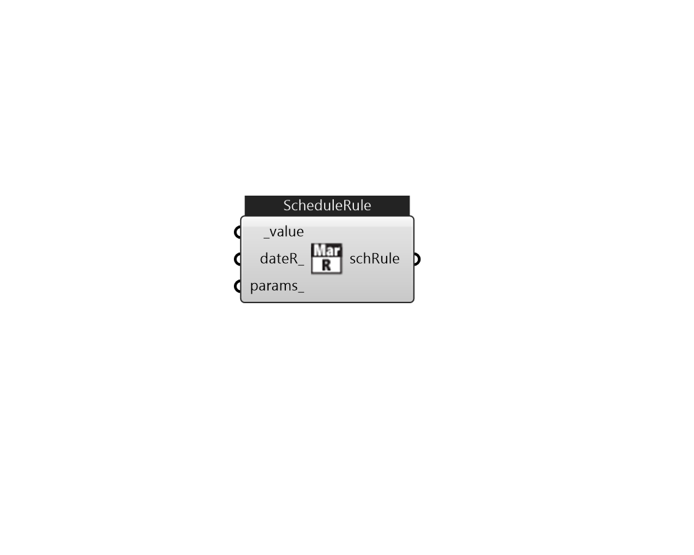

## IB_ScheduleRule

There is no component description available now!  Please stay tuned or contribute :>  Source code: https://github.com/MingboPeng/Ironbug 

#### Inputs
* ##### value [Required]
One value for all day or 24 values for each hour 
* ##### dateR 
Use LB_AnaysisPeriod to create a date range that applies this schedule rule. By default, this rule applies to the entire year. 
* ##### params 
Detail settings for this HVAC object. Use Ironbug_ObjParams to set input parameters, or use Ironbug_OutputParams to set output variables. 

#### Outputs
* ##### schRule
To IB_Schedule 