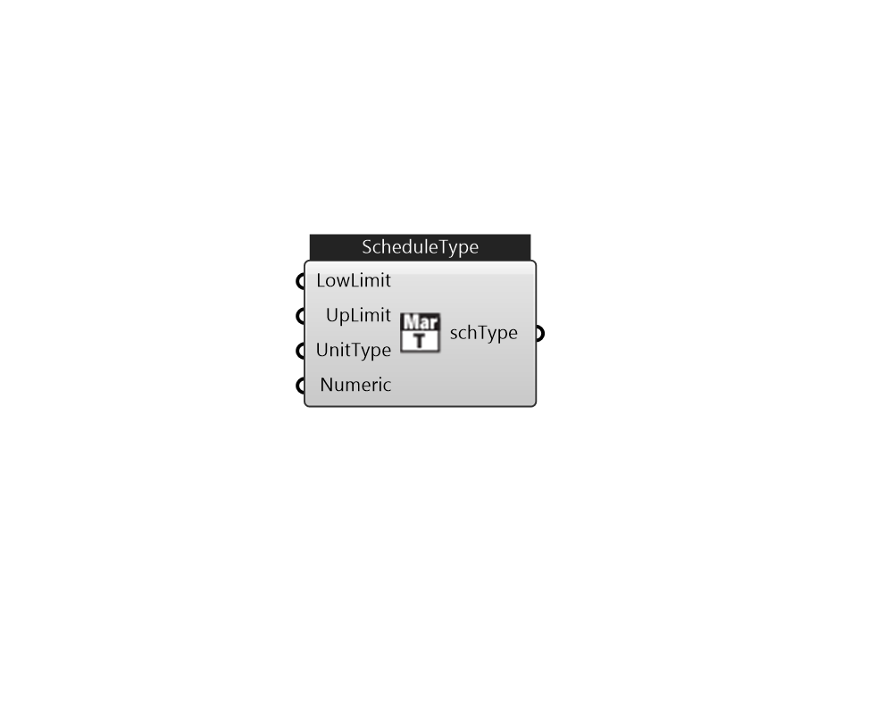

## IB_ScheduleTypeLimits

 

#### Inputs
* ##### LowLimit 
LowerLimitValue 
* ##### UpLimit 
UpperLimitValue 
* ##### UnitType 
 Default: Dimensionless  Valid Options:     -Dimensionless     -Temperature     -DeltaTemperature     -PrecipitationRate     -Angle     -ConvectionCoefficient     -ActivityLevel     -ClothingInsulation     -Velocity     -RotationsPerMinute     -VolumetricFlowRate     -MassFlowRate     -Capacity     -Power     -Pressure     -SolarEnergy     -Availability     -Percent     -Control     -Mode     -ControlMode     -LinearPowerDensity 
* ##### Numeric 
 Valid Options:     -Continuous     -Discrete 

#### Outputs
* ##### schType
To Ironbug_Schedule 