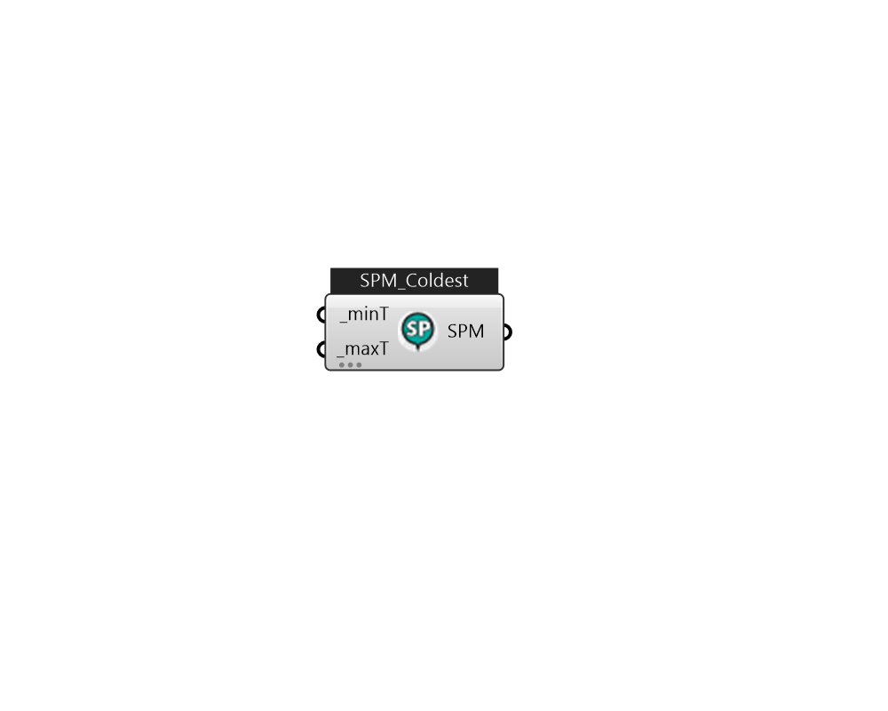

## IB_SetpointManagerColdest

The Coldest Setpoint Manager is used in dual duct systems to reset the setpoint temperature of the air in the heating supply duct or in single duct systems to reset the setpoint temperature of the air for central heating coils. Usually it is used in conjunction with a {SetpointManager:Warmest} resetting the temperature of the air in the cooling supply duct. For each zone in the system at each system timestep, the manager calculates a supply air temperature that will meet the zone heating load at the maximum zone supply air flow rate. The highest of the possible supply air temperatures becomes the new supply air temperature setpoint, subject to minimum and maximum supply air temperature constraints. The resulting temperature setpoint is the lowest supply air temperature that will meet the heating requirements of all the zones. When compared to a fixed heating supply air temperature setpoint, this strategy minimizes central boiler energy consumption (if the hot water temperature is also .... (Due to the length of content, documentation has been shown partially)  Above content copyright © 1996-2025 EnergyPlus, all contributors. All rights reserved. EnergyPlus is a trademark of the US Department of Energy. 

#### Inputs
* ##### minT [Required]
The minimum allowed setpoint temperature in degrees C. If the calculated setpoint temperature is less than this minimum, the setpoint is set to the minimum. This value is also used as the setpoint temperature when none of the zones have a heating load.  Unit: C [IP: F]  Above content copyright © 1996-2023 EnergyPlus, all contributors. All rights reserved. EnergyPlus is a trademark of the US Department of Energy. 
* ##### maxT [Required]
The maximum allowed setpoint temperature in degrees C. If the calculated setpoint is greater than this value the setpoint is set to the maximum.  Unit: C [IP: F]  Above content copyright © 1996-2023 EnergyPlus, all contributors. All rights reserved. EnergyPlus is a trademark of the US Department of Energy. 

#### Outputs
* ##### SPM
TODO:... 