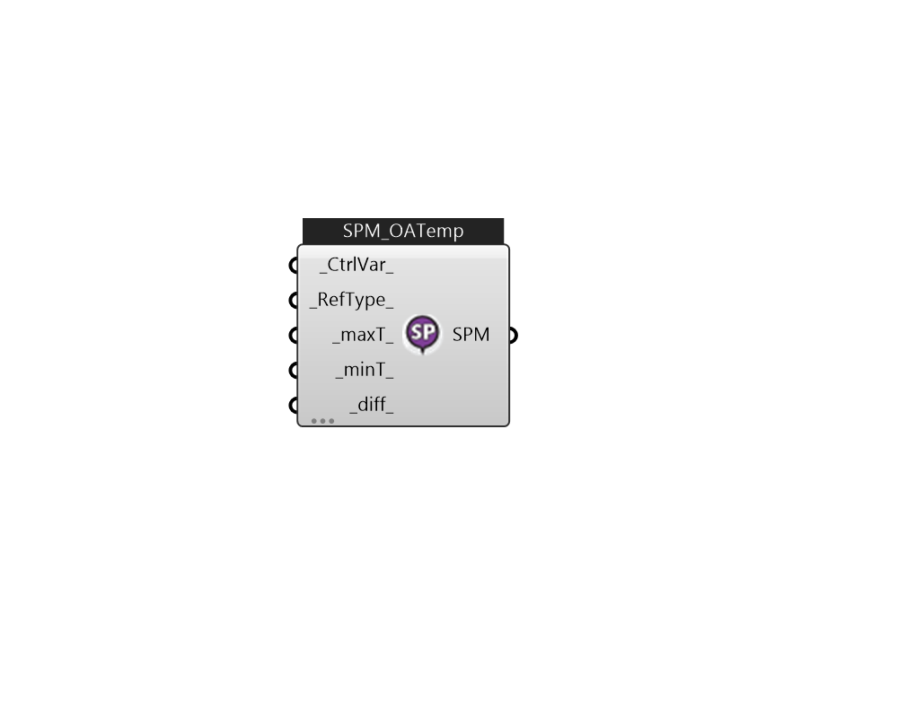

## IB_SetpointManagerFollowOutdoorAirTemperature

This setpoint manager is used to place a temperature setpoint on a system node that is derived from the current outdoor air environmental conditions. The outdoor air conditions are obtained from the weather information during the simulation.  Above content copyright © 1996-2025 EnergyPlus, all contributors. All rights reserved. EnergyPlus is a trademark of the US Department of Energy. 

#### Inputs
* ##### CtrlVar 
The type of variable that will be controlled. There are three choices available: Temperature, MaximumTemperature, or MinimumTemperature.  Default: Temperature  Valid Options:     -Temperature     -MinimumTemperature     -MaximumTemperature  Above content copyright © 1996-2023 EnergyPlus, all contributors. All rights reserved. EnergyPlus is a trademark of the US Department of Energy.  Default:Temperature 
* ##### RefType 
The field specifies the type of temperature value to obtain from the system node referenced in the previous field. The two available options are OutdoorDryBulb and OutdoorWetBulb.  Default: OutdoorAirWetBulb  Valid Options:     -OutdoorAirWetBulb     -OutdoorAirDryBulb  Above content copyright © 1996-2023 EnergyPlus, all contributors. All rights reserved. EnergyPlus is a trademark of the US Department of Energy.  Default:OutdoorAirWetBulb 
* ##### maxT 
This field provides an upper limit to the resulting setpoint value.  Unit: C [IP: F]  Above content copyright © 1996-2023 EnergyPlus, all contributors. All rights reserved. EnergyPlus is a trademark of the US Department of Energy. Default:80C 
* ##### minT 
This field provides a lower limit to the resulting setpoint value.  Unit: C [IP: F]  Above content copyright © 1996-2023 EnergyPlus, all contributors. All rights reserved. EnergyPlus is a trademark of the US Department of Energy. Default:5C 
* ##### diff 
This field provides a temperature offset that will be applied to the value of the reference temperature (outdoor air wetbulb/drybulb). If this value is zero, and the limits are met, then the resulting setpoint will be exactly the same as the outdoor air wetbulb/drybulb temperature. The sign convention is that a positive value here will increase the resulting setpoint to higher than the outdoor air wetbulb/drybulb.  Unit: K [IP: R]  Above content copyright © 1996-2023 EnergyPlus, all contributors. All rights reserved. EnergyPlus is a trademark of the US Department of Energy.Default:0 

#### Outputs
* ##### SPM
TODO:... 