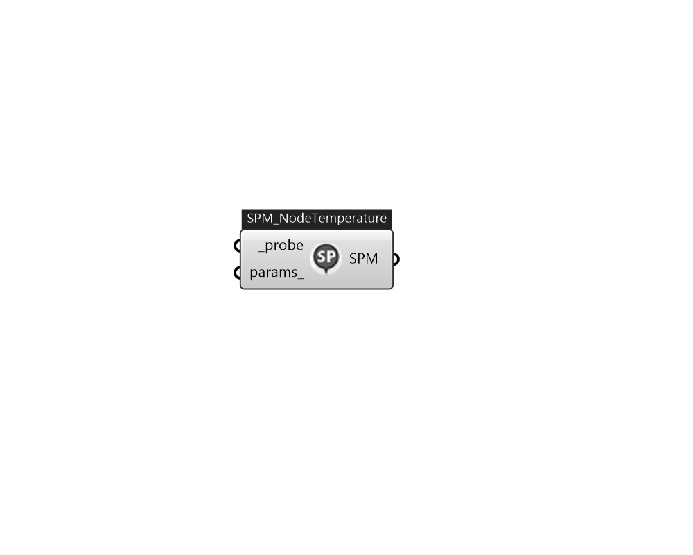

## IB_SetpointManagerFollowSystemNodeTemperature

This setpoint manager is used to place a temperature setpoint on a system node that is derived from the current temperatures at a separate system node. The current value of the temperature at a reference node is obtained and used to generate setpoint on a second system node. If the reference node is also designated to be an outdoor air (intake) node, then this setpoint manager can be used to follow outdoor air conditions that are adjusted for altitude.  Above content copyright © 1996-2025 EnergyPlus, all contributors. All rights reserved. EnergyPlus is a trademark of the US Department of Energy. 

#### Inputs
* ##### probe [Required]
Add a IB_NodeProbe to a loop first, and then connect the probe to here for setpoint manager to use. 
* ##### params 
Detail settings for this HVAC object. Use Ironbug_ObjParams to set input parameters, or use Ironbug_OutputParams to set output variables. 

#### Outputs
* ##### SPM
TODO.. 