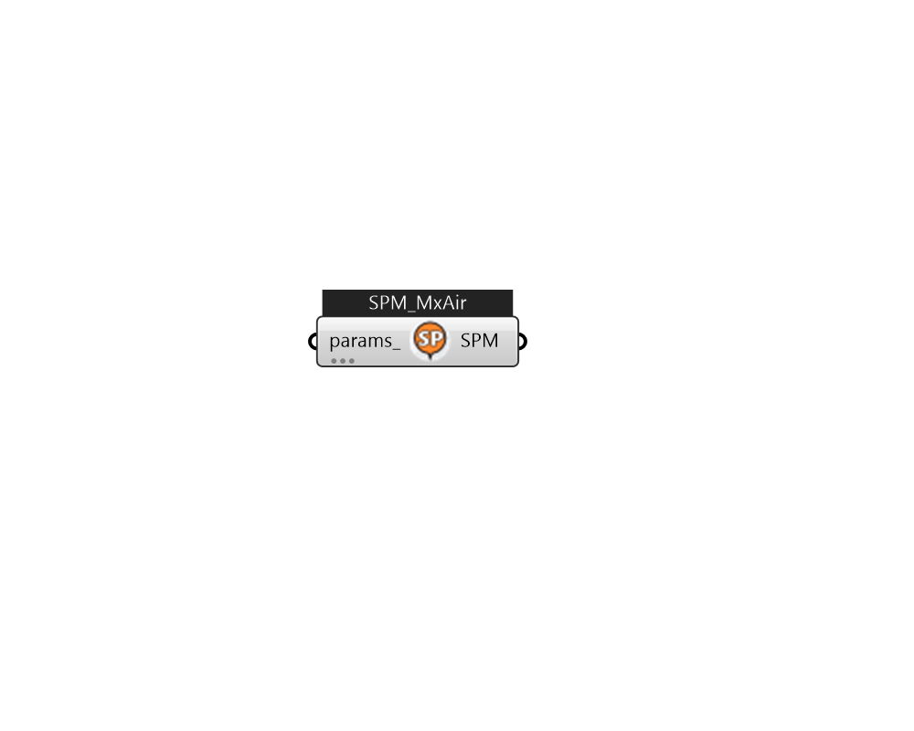

## IB_SetpointManagerMixedAir

The Mixed Air Setpoint Manager is meant to be used in conjunction with a {Controller:OutdoorAir} object. This setpoint manager is used to establish temperature setpoints for any component with a control node that is upstream of the fan. An example of the use of this setpoint manager might be to define a temperature setpoint at the mixed air node. The {Controller:OutdoorAir} then operates the outdoor air damper in an attempt to meet this setpoint. In EnergyPlus the relief and outdoor air dampers, the economizer, and any outdoor air conditioning equipment form a separate subsystem of an air loop system (ref. AirLoopHVAC). The outdoor air controller operates within the subsystem. Consequently the mixed air temperature setpoint must take into account any downstream system fan heat if it is to meet a desired system supply air leaving temperature. The Mixed Air Setpoint Manager accomplishes this by referencing a supply air setpoint set by another setpoint manager (most likely at the AirLoop.... (Due to the length of content, documentation has been shown partially)  Above content copyright © 1996-2025 EnergyPlus, all contributors. All rights reserved. EnergyPlus is a trademark of the US Department of Energy. 

#### Inputs
* ##### params 
Detail settings for this HVAC object. Use Ironbug_ObjParams to set input parameters, or use Ironbug_OutputParams to set output variables. 

#### Outputs
* ##### SPM
TODO:... 