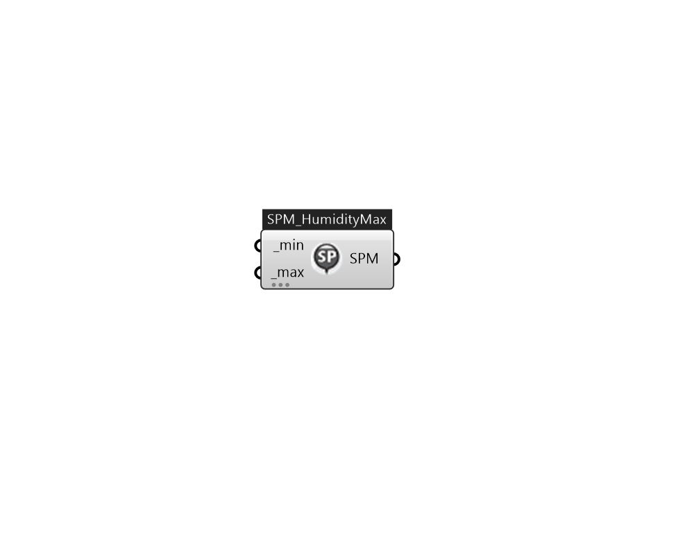

## IB_SetpointManagerMultiZoneHumidityMaximum

This setpoint manager allows for controlling the maximum humidity level in multiple zones served by a central forced air HVAC system (air loop). This setpoint manager, used in conjunction with one or more {ZoneControl:Humidistat} objects, detects the air humidity level in multiple controlled zones served by the HVAC air loop and uses air/moisture mass balances to calculate the maximum supply air humidity ratio based on a zone with the critical dehumidification requirement (i.e., a zone with the lowest humidity ratio setpoint) to maintain the zone relative humidity levels near their respective dehumidifying setpoints. The calculated humidity ratio is then used as the maximum humidity ratio setpoint for the designated setpoint node(s). A dehumidification component (e.g., desiccant dehumidifiers) placed upstream of the setpoint node can then use the maximum humidity ratio setpoint to control its moisture removal rate. The use of this object requires that a {ZoneControl:Humidistat} object .... (Due to the length of content, documentation has been shown partially)  Above content copyright © 1996-2025 EnergyPlus, all contributors. All rights reserved. EnergyPlus is a trademark of the US Department of Energy. 

#### Inputs
* ##### min [Required]
The minimum humidity ratio (kgWater/kgDryAir) that is allowed by this setpoint manager. If the calculated setpoint humidity ratio is less than this value, then the setpoint is set to this minimum value. The default value is 0.008 (kgWater/kgDryAir).   Above content copyright © 1996-2023 EnergyPlus, all contributors. All rights reserved. EnergyPlus is a trademark of the US Department of Energy. 
* ##### max [Required]
The maximum humidity ratio (kgWater/kgDryAir) that is allowed by this set point manager. If the calculated setpoint humidity ratio is greater than this value, then the setpoint is set to this maximum value. The default value is 0.015 (kgWater/kgDryAir).   Above content copyright © 1996-2023 EnergyPlus, all contributors. All rights reserved. EnergyPlus is a trademark of the US Department of Energy. 

#### Outputs
* ##### SPM
TODO:... 