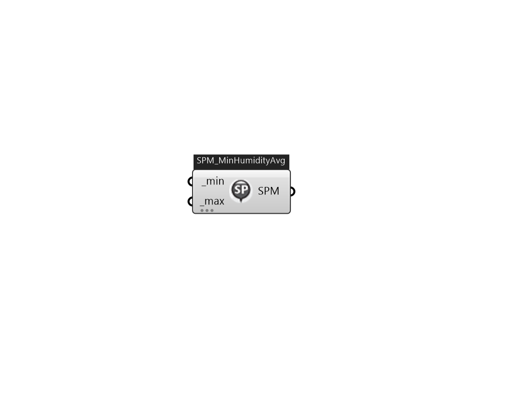

## IB_SetpointManagerMultiZoneMinimumHumidityAverage

This setpoint manager allows for controlling the minimum humidity level is multiple zones served by a central forced air HVAC system (air loop). This setpoint manager, used in conjunction with one or more {ZoneControl:Humidistat} objects, detects the air humidity level in multiple controlled zones served by the HVAC air loop and uses air/moisture mass balances to calculate an average supply air humidity ratio needed to maintain the zone relative humidity levels near their respective humidifying setpoints. The calculated humidity ratio is then used as the minimum humidity ratio setpoint for the designated setpoint node(s). A humidification component (e.g., {Humidifier:Steam:Electric}) placed upstream of the setpoint node can then use the minimum humidity ratio setpoint to control humidification rate. The use of this object requires that a {ZoneControl:Humidistat} object be specified with a humidifying relative humidity schedule for one or more controlled zones served by the HVAC air loo.... (Due to the length of content, documentation has been shown partially)  Above content copyright © 1996-2025 EnergyPlus, all contributors. All rights reserved. EnergyPlus is a trademark of the US Department of Energy. 

#### Inputs
* ##### min [Required]
The minimum humidity ratio (kgWater/kgDryAir) that is allowed by this setpoint manager. If the calculated setpoint humidity ratio is less than this value, then the setpoint is set to this minimum value. The default value is 0.005 (kgWater/kgDryAir).  Default: 0.005   Above content copyright © 1996-2023 EnergyPlus, all contributors. All rights reserved. EnergyPlus is a trademark of the US Department of Energy. 
* ##### max [Required]
The maximum humidity ratio (kgWater/kgDryAir) that is allowed by this setpoint manager. If the calculated setpoint humidity ratio is greater than this value, then the setpoint is set to this maximum value. The default value is 0.012 (kgWater/kgDryAir).  Default: 0.012   Above content copyright © 1996-2023 EnergyPlus, all contributors. All rights reserved. EnergyPlus is a trademark of the US Department of Energy. 

#### Outputs
* ##### SPM
TODO:... 