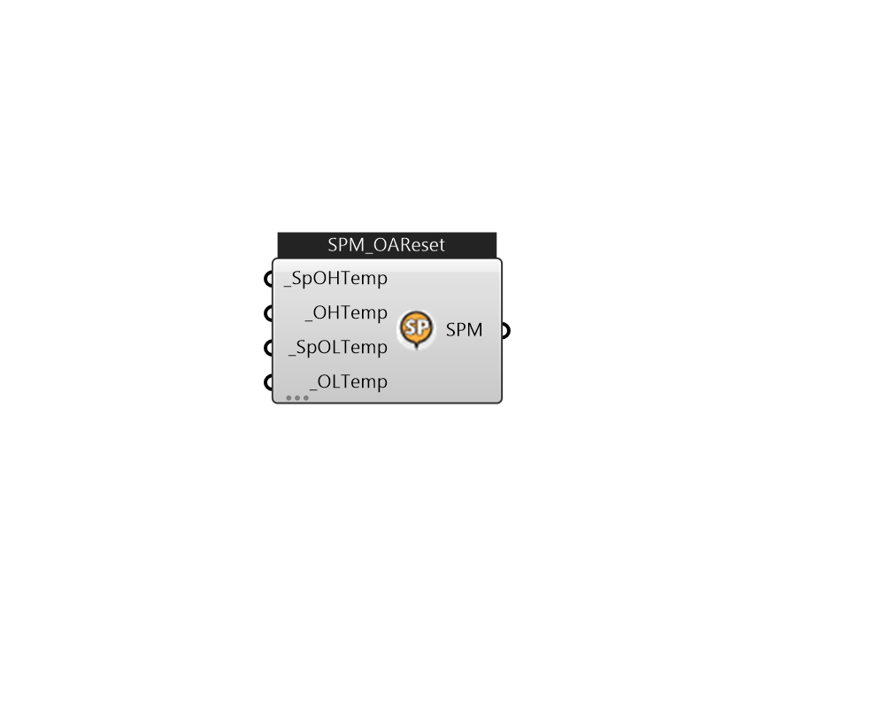

## IB_SetpointManagerOutdoorAirReset

The Outdoor Air Reset Setpoint Manager is used to place a setpoint temperature on a system node according to the outdoor air temperature using a reset rule. The reset rule is determined by 2 points: the setpoint temperature at the outdoor air high temperature (TSetAtOAHigh) and the setpoint temperature at the outdoor air low temperature (TSetAtOALow). If the outdoor air temperature is above the outdoor air high temperature limit, the setpoint temperature is set to TSetAtOAHigh. If the outdoor air temperature is below the outdoor air low temperature limit, the setpoint temperature is set to TSetAtOALow. If the outdoor air temperature is between the outdoor air high and outdoor air low temperatures limits, the setpoint temperature is linearly interpolated between TSetAtOAHigh and TSetAtOALow. The outdoor air temperature is obtained from the weather information during the simulation. This setpoint manager can be used to place a setpoint temperature on air loop and plant loop system nodes..... (Due to the length of content, documentation has been shown partially)  Above content copyright © 1996-2025 EnergyPlus, all contributors. All rights reserved. EnergyPlus is a trademark of the US Department of Energy. 

#### Inputs
* ##### SpOHTemp [Required]
The supply air temperature setpoint in ^oC at the outdoor high temperature for the first reset rule.  Unit: C [IP: F]  Above content copyright © 1996-2023 EnergyPlus, all contributors. All rights reserved. EnergyPlus is a trademark of the US Department of Energy. 
* ##### OHTemp [Required]
The outdoor air high temperature in ^oC for the first supply air temperature reset rule. Generally, at this outdoor air temperature the supply temperature is at its minimum.  Unit: C [IP: F]  Above content copyright © 1996-2023 EnergyPlus, all contributors. All rights reserved. EnergyPlus is a trademark of the US Department of Energy. 
* ##### SpOLTemp [Required]
The supply air temperature setpoint in ^oC at the outdoor low temperature for the first reset rule.  Unit: C [IP: F]  Above content copyright © 1996-2023 EnergyPlus, all contributors. All rights reserved. EnergyPlus is a trademark of the US Department of Energy. 
* ##### OLTemp [Required]
The outdoor air low temperature in ^oC for the first supply air temperature reset rule. Generally, at this outdoor air temperature the supply temperature is at its maximum.  Unit: C [IP: F]  Above content copyright © 1996-2023 EnergyPlus, all contributors. All rights reserved. EnergyPlus is a trademark of the US Department of Energy. 

#### Outputs
* ##### SPM
TODO:... 