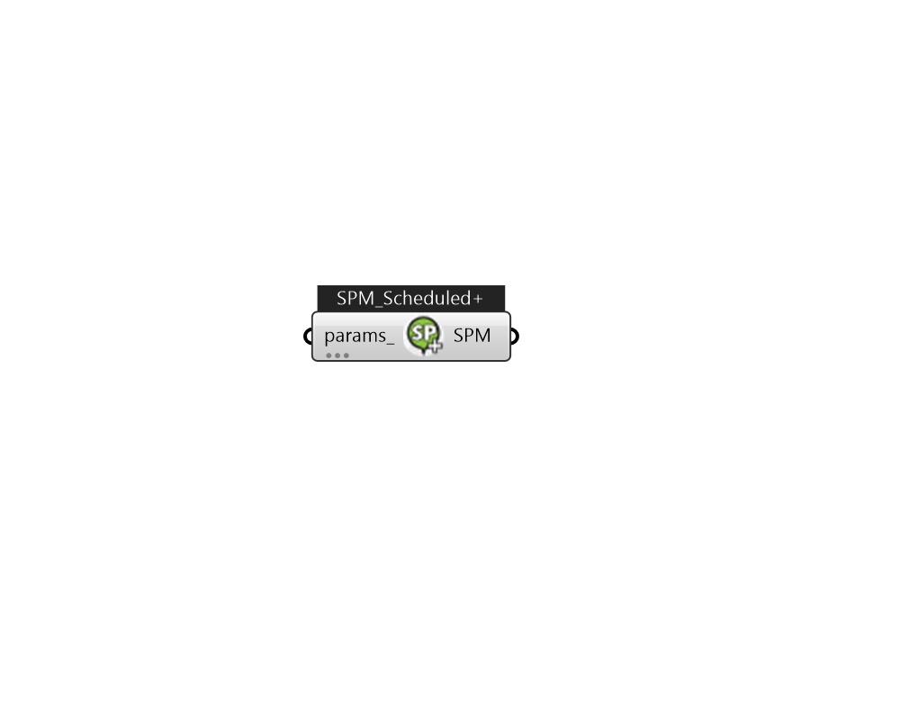

## IB_SetpointManagerScheduled+

The simplest Setpoint Manager simply uses a schedule to determine one or more setpoints. No node data is used as input. The input consists of the Setpoint Manager name, the control variable, the schedule name, and the name of a node list. The node list contains the name of those nodes at which the setpoint is to be applied. Of course, a node list name can always be simply the name of a single node. Note that although this object provides a very general method of setting the values of many different control variables on nodes, the component models and system solvers may or may not be able to use them. Therefore, it is important to understand that simply setting a control variable using this object will not necessarily always produce the desired behavior.  Above content copyright © 1996-2025 EnergyPlus, all contributors. All rights reserved. EnergyPlus is a trademark of the US Department of Energy. 

#### Inputs
* ##### params 
Detail settings for this HVAC object. Use Ironbug_ObjParams to set input parameters, or use Ironbug_OutputParams to set output variables. 

#### Outputs
* ##### SPM
TODO:... 