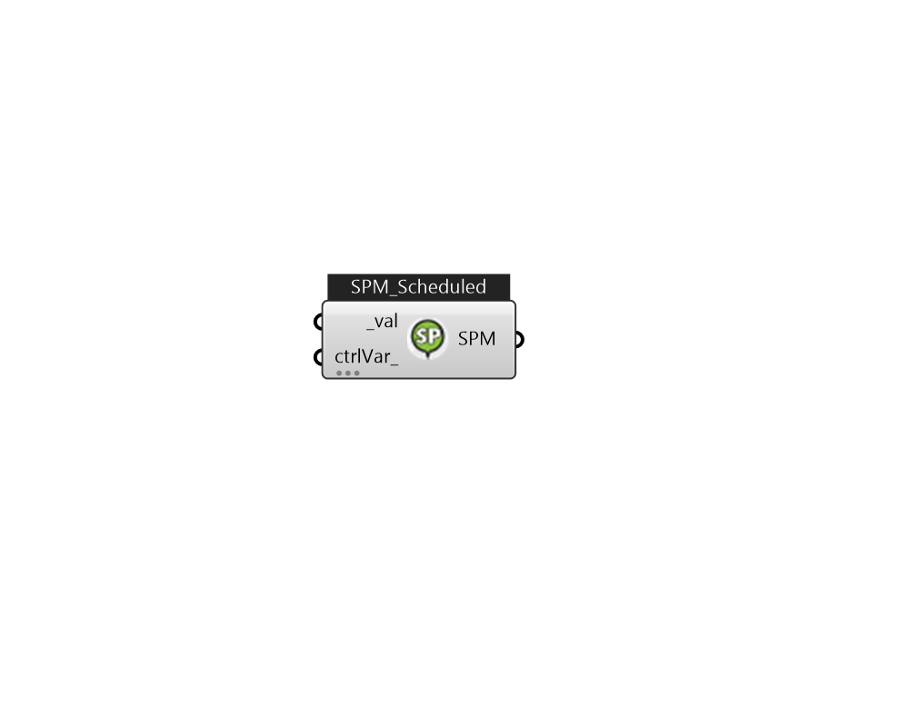

## IB_SetpointManagerScheduled

The simplest Setpoint Manager simply uses a schedule to determine one or more setpoints. No node data is used as input. The input consists of the Setpoint Manager name, the control variable, the schedule name, and the name of a node list. The node list contains the name of those nodes at which the setpoint is to be applied. Of course, a node list name can always be simply the name of a single node. Note that although this object provides a very general method of setting the values of many different control variables on nodes, the component models and system solvers may or may not be able to use them. Therefore, it is important to understand that simply setting a control variable using this object will not necessarily always produce the desired behavior.  Above content copyright © 1996-2025 EnergyPlus, all contributors. All rights reserved. EnergyPlus is a trademark of the US Department of Energy. 

#### Inputs
* ##### val [Required]
Setpoint value 
* ##### ctrlVar 
The type of variable that will be controlled. There are several choices for this type of set point manager. The most common control variable is Temperature but other major choices include: HumidityRatio and MassFlowRate. The versatility of control variables available here (probably) exceeds what is actually available in the component and systems models. However, a large number of possible control variables are made available here for maximum flexibility and because some (but not all) component models will be able to use them. The complete list of key words and the units required in the associated schedules follow. Temperature Temperature of fluid at node ( °C) MaximumTemperature Maximum temperature of fluid at node ( °C) MinimumTemperature Minimum temperature of fluid at node ( °C) HumidityRatio Humidity ratio of fluid at node (kgWater/kgDryAir) MaximumHumidityRatio Maximum humidity ratio of fluid at node (kgWater/kgDryAir) MinimumHumidityRatio Minimum humidity ratio of fluid at node (kgWater/kgDryAir) MassFlowRate Mass flow rate of fluid at node (kg/s) MaximumMassFlowRate Maximum mass flow rate of fluid at node (kg/s) MinimumMassFlowRate Minimum mass flow rate of fluid at node (kg/s)  Valid Options:     -Temperature     -MaximumTemperature     -MinimumTemperature     -HumidityRatio     -MaximumHumidityRatio     -MinimumHumidityRatio     -MassFlowRate     -MaximumMassFlowRate     -MinimumMassFlowRate  Above content copyright © 1996-2023 EnergyPlus, all contributors. All rights reserved. EnergyPlus is a trademark of the US Department of Energy. 

#### Outputs
* ##### SPM
TODO:... 