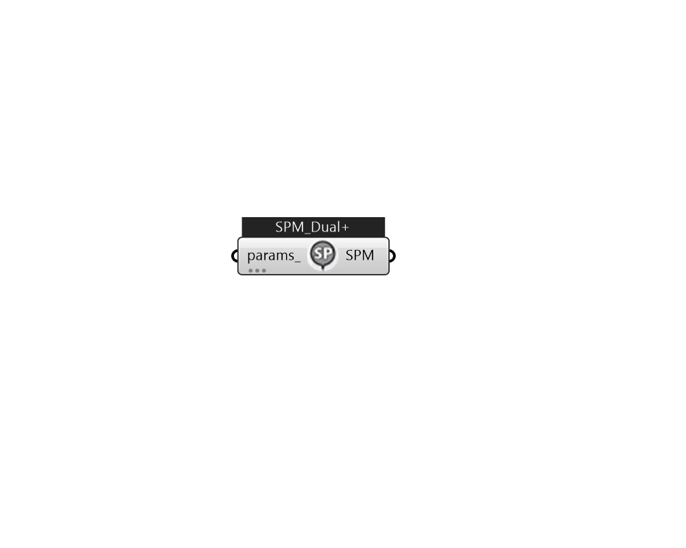

## IB_SetpointManagerScheduledDualSetpoint+

This setpoint manager places a high and low schedule value on one or more nodes. The input consists of the Setpoint Manager name, the control variable, the high and low set point schedule names, and the name of a node list. The node list contains the name of those nodes at which the setpoint is to be applied. Of course, a node list name can simply be the name of a single node. Currently the DualSetpoint Manager will be used with PlantLoop when the Plant Loop Demand Calculation Scheme is set to DualSetpointDeadband .  Above content copyright © 1996-2025 EnergyPlus, all contributors. All rights reserved. EnergyPlus is a trademark of the US Department of Energy. 

#### Inputs
* ##### params 
Detail settings for this HVAC object. Use Ironbug_ObjParams to set input parameters, or use Ironbug_OutputParams to set output variables. 

#### Outputs
* ##### SPM
TODO:... 