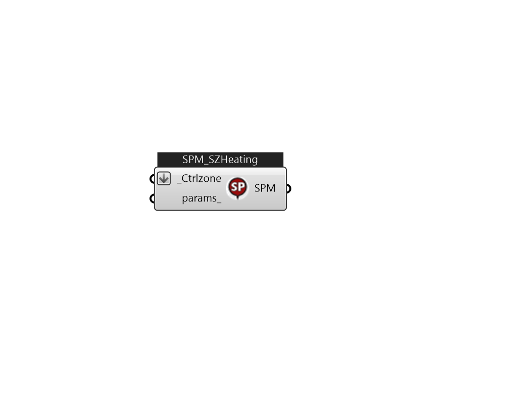

## IB_SetpointManagerSingleZoneHeating

The Single Zone Heating Setpoint Manager allows a component to be controlled based on the load required to meet the zone heating setpoint. The setpoint manager detects the control zone load to meet the current heating setpoint, zone inlet node flow rate, and zone node temperature, and calculates a setpoint temperature for the supply air that will satisfy the zone heating load for the control zone. This setpoint manager creates a variable temperature system. The input consists of the setpoint manager name, the controlled variable type, the minimum and maximum supply air temperatures, the name of the control zone, the name of the control zone node, the name of the control zone inlet node, and the name of a node or node list containing the nodes whose setpoint temperatures are to be set by this manager.  Above content copyright © 1996-2025 EnergyPlus, all contributors. All rights reserved. EnergyPlus is a trademark of the US Department of Energy. 

#### Inputs
* ##### Ctrlzone [Required]
The name of the control zone for this setpoint manager. The heating load for this zone (to meet the zone heating setpoint) determines the supply air temperature setpoint. 
* ##### params 
Detail settings for this HVAC object. Use Ironbug_ObjParams to set input parameters, or use Ironbug_OutputParams to set output variables. 

#### Outputs
* ##### SPM
TODO:... 