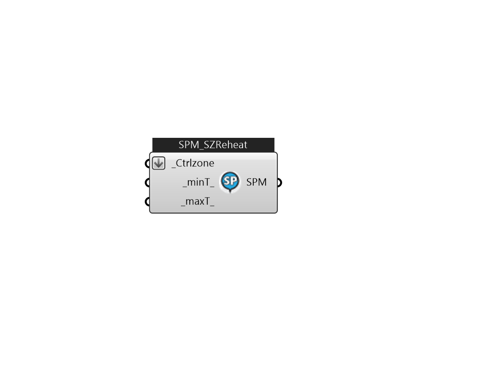

## IB_SetpointManagerSingleZoneReheat

The Single Zone Reheat Setpoint Manager allows the simulation of a single zone reheat system. This setpoint manager detects the control zone load, zone inlet node flow rate, and zone node temperature and calculates a setpoint temperature for the supply air that will satisfy the zone load for the control zone. This setpoint manager creates a variable temperature system. The input consists of the setpoint manager name, the control variable type, the minimum and maximum supply air temperatures, the name of the control zone, the name of the control zone node, the name of the control zone inlet node, and the name of a node or node list containing the nodes whose setpoint temperatures are to be set by this manager.  Above content copyright © 1996-2025 EnergyPlus, all contributors. All rights reserved. EnergyPlus is a trademark of the US Department of Energy. 

#### Inputs
* ##### Ctrlzone [Required]
The name of the control zone for this single zone reheat system. The heating or cooling load for this zone determines the supply air temperature setpoint. 
* ##### minT 
The minimum supply air temperature (in ^oC) that is allowed for this system (as set by this setpoint manager).  Unit: C [IP: F]  Above content copyright © 1996-2023 EnergyPlus, all contributors. All rights reserved. EnergyPlus is a trademark of the US Department of Energy. 
* ##### maxT 
The maximum supply air temperature (in ^oC) that is allowed for this system (as set by this setpoint manager)  Unit: C [IP: F]  Above content copyright © 1996-2023 EnergyPlus, all contributors. All rights reserved. EnergyPlus is a trademark of the US Department of Energy. 

#### Outputs
* ##### SPM
TODO:... 